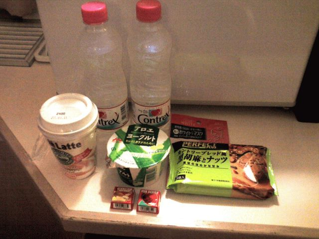

# [mixi] 1,000円お買い物ゲーム

**作成日:** 2006-03-13

週末大阪に戻ってたのですが、出張パックを利用したので、金曜は淀屋橋に宿泊してました。その日は友達と北浜で飲んでて、実家に帰れないこともなかったのですが、ホテルに泊まることに。

出張パックの場合、ふつう朝食がついてるんですが、金曜に泊まったホテルは、ホテルの朝食、隣のコンビニで1,000円買い物、有料テレビのどれかに使えるというチケットを1枚くれました。

こういうのは初めてだったので1,000円お買い物することにしました。あれやこれや選んでレジに行くと、合計944円。レジのおっちゃんが「まだ買えますよ。あそこに20円のチョコレートあります。」とすすめてくれたので、チロルチョコ2個買って、結局合計984円買いました。なかなか上手く買えました。

---

## イイネ (13)

- きたまこと
- KOHJI＠掬水月在手
- ゆみちん
- しのみん
- まほ
- タク
- Buddy
- arancio
- ぷち
- ケルマデック
- でんじろう。
- YASUO
- さぁ

---

## コメント

**マイリスト**

マイミク一覧

**1,000円お買い物ゲーム編集する**

2006年03月13日23:32

**ぷち2006年03月14日 00:20**

た、たのしそう…
私だったら何を買うかしら、などと考えてしまいました。
しかしチロルチョコ（かな？）って今は20円なんですね。
私が買ってたときの倍かぁ。

**arancio2006年03月14日 00:24**

1,000円で、けっこう楽しめます。
おつりはもらえない、というルールなんで、必要なさそうなものも取りあえず買っちゃえ、というノリです。

**でんじろう。2006年03月14日 00:49**

チロルチョコ「きなこもち」っ？？？
（ちょっと前、一部地域で話題でした！笑）

**arancio2006年03月14日 00:52**

あ、たぶん違います。
マンゴーとミックスベリーだったかなあ。
結局私は食べずに、実家に持って帰って置いてきました。

**しのみん2006年03月14日 00:59**

うにゃ～。こんとれっくすだぁ～。
あれ、あの濃さにやみつきです（＾＾；
私は多分、飲み物＆普段かわなさそうなものを選ぶかな。
文房具買ってるようなきもする。。。。(*^o^*)
半端な金額分は「酢だこさん太郎」とか（爆）

**2026年**

01月
02月
03月
04月
05月
06月
07月
08月
09月
10月
11月
12月
