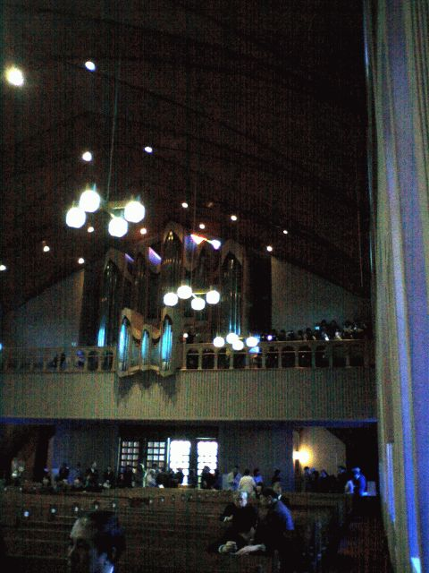
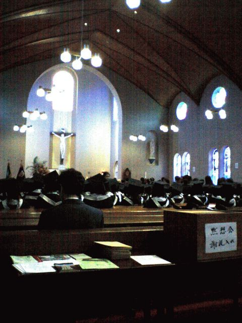

# [mixi] 卒業式と謝恩会

**作成日:** 2006-03-15

今日は雪のちらつく中、卒業式を迎えました。

教会でやるので、寒いのはいやん、なんですが、今年から暖房が入るようになってましといえばまし。

教会には立派なパイプオルガンがあってなかなか気持ちがいいです。

卒業生はみなお揃いの式服（帽子とフード）を身につけて、とてもかわいらしい。

厳かに式が終わり、ゼミ生に卒業生控え室に来て下さいと言われついて行くとお花をもらう。去年は花束でうちに花瓶がなく困ったので、その後花瓶を買い、買ってすぐに掃除の時に倒してかけちゃったやつがあるのですが、今年は籠に桜やチューリップをいけたのをもらって、結局花瓶はいらなかった...

謝恩会は夕方から。袴姿も多いが、ドレスの方が圧倒的に多く、華やかな雰囲気。まあ、大撮影大会って感じです。ビールを飲みつつうだうだと過ごし、抽選会(?)で電波目覚まし時計があたる。ゼミ生からは寄せ書きの色紙をもらう。

8時過ぎにお開きで、結局友達と一杯だけ飲んで帰る、といいつつ三杯ずつ飲んで11時過ぎに帰宅。

---

## イイネ (12)

- きたまこと
- KOHJI＠掬水月在手
- まほ
- ゆみちん
- タク
- Buddy
- arancio
- ぷち
- ケルマデック
- でんじろう。
- YASUO
- さぁ

---

## コメント

**マイリスト**

マイミク一覧

**卒業式と謝恩会編集する**

2006年03月15日01:10

**ぷち2006年03月15日 01:51**

いままで全く知る由もなかったのですが…arancioさんは
教育関係ご勤務ですか？大学１年のときに教職課程で
早々と脱落した私からすれば、事務員さんも用務員さんも
あの若いエネルギーに対応できるっていうだけで、
学校におつとめする人はみな尊敬の対象です。

**でんじろう。2006年03月15日 21:01**

すごーいすてきなところで卒業式なんですねー♪
うちの大学もキリスト系やったけど、こんなすてきじゃなかった。（たしか隣の女子大のホールかなんかだった気がする。ま、古めかしい建物ではあったが。）
袴姿かぁ、もう二度と着ることないですね。袴って大学の卒業式しか着る機会ないもん、なぜなんだろう？

**arancio2006年03月16日 23:31**

＞ぷちさん
若いエネルギーに対応できてるか？うーんどうでしょう。
エネルギーをもらうことはあるような気がします。
＞でんじろう。さん
私は袴って着たことないので、いつか着てみたいです。
同僚の先生（だいぶ年上ですが）は、高校の先生をしていた頃卒業式に袴をはいてたそうです。

**2026年**

01月
02月
03月
04月
05月
06月
07月
08月
09月
10月
11月
12月
