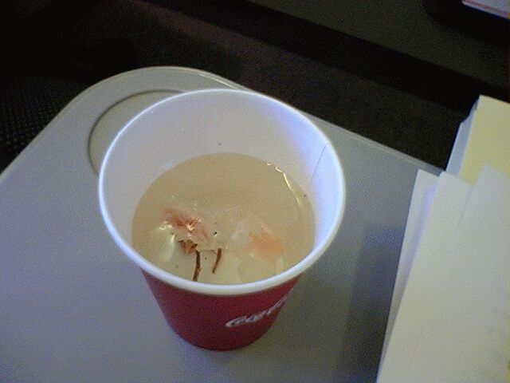
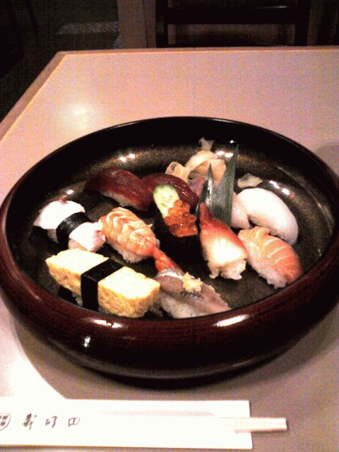

# [mixi] 出張

**作成日:** 2006-03-17

1泊で東京出張。

行きはクラスJで、桜ティーをもらう。

春らしくてうれしい。

出張の目的は学会に出席するため。アルバイト先が事務局をしていた関係で、学生時代から加入していた学会で、一番つきあいが深い学会かも。会期は月曜から金曜までで、以前は4日間とか、5日間出席し、かつ毎日のように宴会してました。現在の職場にうつってからは毎回卒業式と重なって1日顔をだすのがやっと。それでも前泊して、宴会には出席。

スケジュールがきついので、来年から出席するのやめようかなとか考えてたのですが、会場に行くと、元上司とか、元同僚とか、友人とか、滅多に会わない人に次々声をかけられて、みんなにこにこしてるし、やっぱり顔を出さなあかんよなあ、と反省する。

9時長崎着の便で帰る予定だったので、羽田で早めに夕食を食べて帰ってくる。お寿司、まあまあおいしかったです。空港で売ってるお弁当はけっこう高いし、お店で食べて正解でした。

---

## イイネ (11)

- きたまこと
- KOHJI＠掬水月在手
- ゆみちん
- まほ
- タク
- Buddy
- arancio
- ケルマデック
- YASUO
- さぁ
- 大ちゃん＠ﾗﾃﾝ大阪

---

## コメント

**マイリスト**

マイミク一覧

**出張編集する**

2006年03月17日00:13

**大ちゃん＠ﾗﾃﾝ大阪2006年03月17日 21:31**

菅丞相は観なかったんですか？
僕は来月密かに「Ｗ貢さん」を計画中（笑）。

**arancio2006年03月17日 21:46**

あー、ぜんぜん余裕ありませんでした。
明日から東京へ遊びに行くんで、どうしよっかな。
貢さん、観たいなあ。

**2026年**

01月
02月
03月
04月
05月
06月
07月
08月
09月
10月
11月
12月