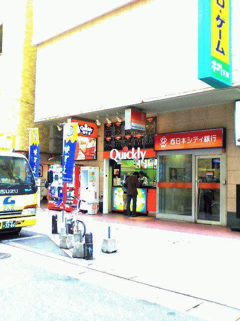
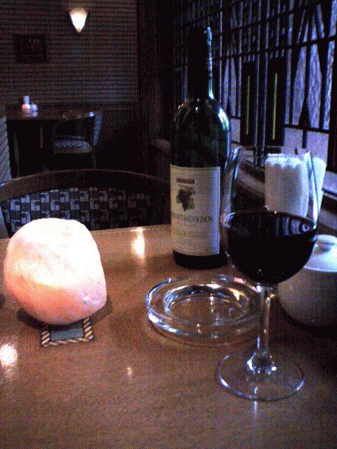
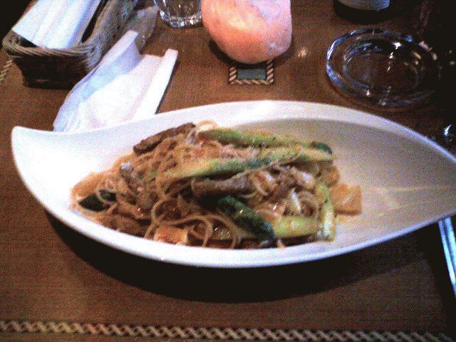

# [mixi] 博多へ行く

**作成日:** 2006-03-25

昨日は、朝の8時過ぎまでがんばって書類を仕上げて送り、一眠りして午後から博多へ出かける。

小林賢太郎のソロコントライブを観るため。

開演は7時ですが、3時頃天神についてうろうろ。

とりあえず三越の食料品売り場を見た後、いつもはあまり行かない

天神コアへ行ってみることにする。が、結局ビブレに行ってしまう。

ビブレを出て、裏通り(?)にクイックリー発見！クイックリーは台湾が本拠のドリンク店。タピオカ入りの飲みものがメイン。ここのドリンクは大好きだけど、これを飲んじゃうと夕食が食べられないので今日は我慢。

ジュンク堂へ行って、しばらく遊ぶ。

パンツェッタ貴久子さんの本を一冊買ってでる。

その後、三越でおやつなどを買って、早めの夕食をとる。

今日は前から気になっていた暖家という店に行くと決めてたので、三越を出て直行。

イベリコ豚とアスパラガスのパスタとグラスワインを頼んだら、ワインが少し残ってるとのことで、ウエイターのお兄ちゃんがテーブルにボトルを置いてってくれる...

パスタはアスパラガスがすごくおいしかった。

食事を済ませ、地下鉄で会場に向かったのでした。

---

## イイネ (11)

- きたまこと
- KOHJI＠掬水月在手
- Jane Birkin
- ゆみちん
- まほ
- タク
- Buddy
- arancio
- ケルマデック
- YASUO
- さぁ

---

## コメント

**マイリスト**

マイミク一覧

**博多へ行く編集する**

2006年03月25日01:38

**Jane Birkin2006年03月25日 01:58**

クイクリーではなにを飲む？
私はココアのタピオカ入りヽ(＾ワ＾)ﾉ

**arancio2006年03月25日 03:44**

ミルクティーかなあ。緑豆が入ったのとかも好きです。
福岡のクイックリーは未体験。
那覇のクリックリーは沖縄に行く度に行ってます。
「どうぞ～おためし～ください～」と独特の呼び込みをやってます。
ココアは飲んだことないなあ。
機会があったらトライしてみます。

**2026年**

01月
02月
03月
04月
05月
06月
07月
08月
09月
10月
11月
12月
