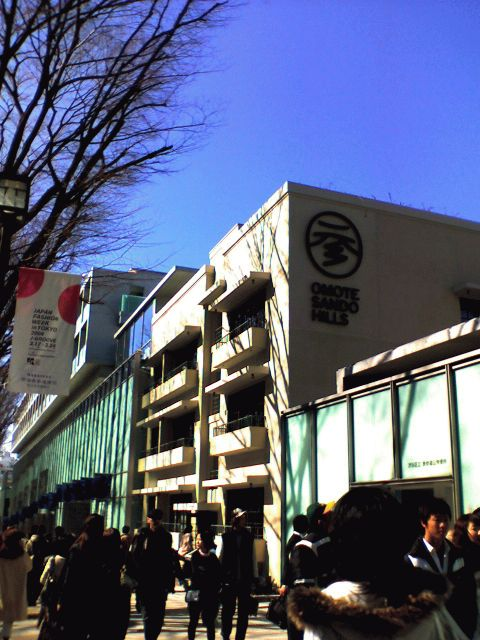
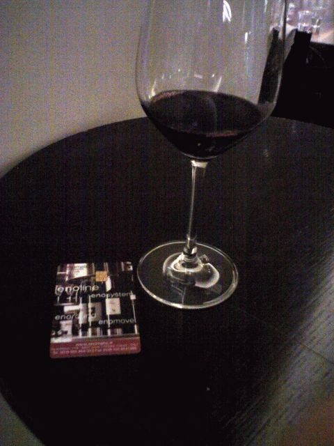

# [mixi] 表参道

**作成日:** 2006-03-26

連休の谷間の月曜は話題の表参道ヒルズを見物に行く。

ロゴがなかなかしゃれてます。

平日とはいえすごい人。

さくっと1周見物して帰る、つもりがワイン屋にひっかかる。

カードに現金をチャージして、テイスティングマシン(?)にカードを入れて好きなワインを好きな分量で有料テイスティングできる仕組み。おもしろそうなので、飲んじゃいました。

とりあえず2,000円チャージ（余ったら後で返金してもらえる）しました。20mlで1500円以上するオーパスワンを飲んでみたかったけど、やっぱりもったいなくて飲めませんでした。結局、3種類のワインを1,000円ちょっと使って飲みました。

表参道ヒルズを出て、すごーく暇そうなベネトンで服を買う。

あー散財と思って裏通りに入ってみると、着物の古着屋があり、羽織を買ってしまう。着る機会はそうそうないのだが、きれいな青でしつけ糸もついてて、裏地がチューリップでものすごくかわいらしく安かったので買ってしまいました。

これで買い物はおしまい、かと思っていたら、結局翌日も表参道に来てしまい、古着屋の閉店セールで大量に洋服を買い込むはめになってしまいました。こっちも安かったですが。

---

## イイネ (9)

- きたまこと
- KOHJI＠掬水月在手
- ゆみちん
- まほ
- タク
- Buddy
- ケルマデック
- YASUO
- さぁ

---

## コメント

**マイリスト**

マイミク一覧

**表参道編集する**

2006年03月26日02:34

**2026年**

01月
02月
03月
04月
05月
06月
07月
08月
09月
10月
11月
12月
