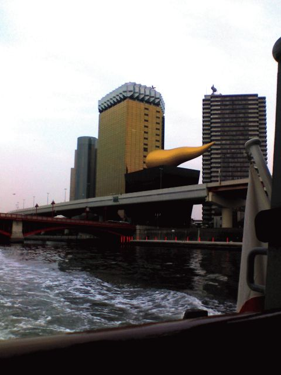

# [mixi] 水上バス

**作成日:** 2006-03-26

さて連休最終日、7時過ぎに羽田を出発する便で帰る予定でした。

表参道（原宿っていうべき??）でたっぷり買い物した後、早めの夕食を何にしようか迷ったあげく浅草でどじょうでも食べようということになり、浅草線で浅草へ。

浅草駅で長命寺の桜餅の広告を見て、桜餅を食べたくなる。

桜餅を求めて、隅田公園に向かう途中水上バス乗り場を通りかかって、桜餅を持って水上バスに乗るというのを思いつき、どじょうは放棄。

長命寺が思ったより遠く、ずっと看板は出てるけど「この先」としか書いてないのは残りの距離を書いたら嫌になってやめるから？と勘ぐりつつひたすら歩く。

向島は、花街らしく、料亭だらけで、見番とかもあって、風情がありました。

長命寺にたどりつき、お土産用の桜餅も買ったけど、お店でも食べる。あっさりあんでおいしかったです。ここの桜餅は一つに桜の葉が三枚も使ってあって、葉を全部食べるものなのかどうかよくわからなくて、困りました。店内を観察した限りでは、食べてない人多かったです。翌日持って帰った分を食べて検討した結果、三枚の葉っぱのうち、一枚を残して食べるのが私にはベストでした。

一生懸命早足で歩いて、日の出桟橋行きの水上バスに乗る。

道中、ガイドさんが日本語と英語でずっと解説してて楽しかった！

外人さんは喜ぶだろうなあ。40分ちょっとの航路ですが、大満足。

久しぶりに浜松町からモノレールに乗って羽田へ。

空港でお寿司を食べて、帰ってきました。

---

## イイネ (11)

- きたまこと
- KOHJI＠掬水月在手
- jamaica
- ゆみちん
- まほ
- タク
- Buddy
- arancio
- ケルマデック
- YASUO
- さぁ

---

## コメント

**マイリスト**

マイミク一覧

**水上バス編集する**

2006年03月26日03:01

**jamaica2006年03月26日 07:10**

忙しそうですが、楽しんでますね！ヨイことですな！
おつかれさまです！

**arancio2006年03月26日 20:08**

ありがとうございます。
新年度が始まると忙しくなりそうので、まとめて遊んでます。

**2026年**

01月
02月
03月
04月
05月
06月
07月
08月
09月
10月
11月
12月
