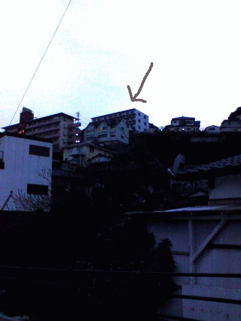

# [mixi] 今日の散歩

**作成日:** 2006-03-26

夕方歩いて最寄りのパン屋へ行く。

自分ちのある丘を下り、隣の丘を越えて、徒歩20分。

天気のよい休日らしく、パン屋さんの品物はかなり少ない。

食パンを朝食用に買い、店内でコーヒーと小さいフランスパンにチョコレートとオレンジをはさんだおやつパンと食べる。

一応、読むべき雑誌がなかった時のために本を持参してたが、アルネの最新号があったのでそちらを読む。

梅好の京ちらしと和菓子工房まっちんのくるみわらび餅がすごーくおいしそうでした。

梅好

http://www1.ttcn.ne.jp/~baikou/

和菓子工房　まっちん

http://www3.kcn.ne.jp/~s-heads/matchin/index2.html

まっすぐ帰ろうかと思ったけど、結局近くのスーパーで買い物して帰途につく。

帰り道ふと見上げると、うちのマンションがある丘のふもとの道からうちが見えるというのに初めて気がつきました。ふもとの道といっても、ここが既にちょっと登ったところなんで、うちはかなりの高さがありそうです。

どのくらいの高さに住んでるのか知りたいんですが、高度計つき腕時計とか持ってる人遊びに来てくれないかなあ。

---

## イイネ (9)

- きたまこと
- KOHJI＠掬水月在手
- ゆみちん
- まほ
- タク
- Buddy
- ケルマデック
- YASUO
- さぁ

---

## コメント

**マイリスト**

マイミク一覧

**今日の散歩編集する**

2006年03月26日19:49

**2026年**

01月
02月
03月
04月
05月
06月
07月
08月
09月
10月
11月
12月