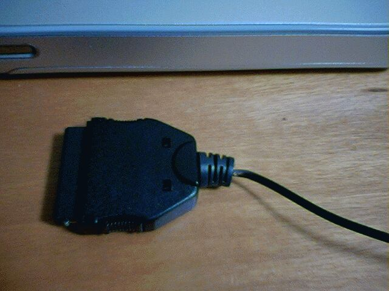

# [mixi] つながらない

**作成日:** 2006-03-28

スケジュール管理とか、メモ代わりの写真なんかはクリエTH55というのを使ってます。

撮った写真をPowerBookに移そうと思ったら、HotSyncできなくて、クリエのメモリスティックをPCのストレージとして使うデータ接続のモードも使えない。ゆうべもちょっとおかしかったんだけど、何度かやってるうちにつながったのですが、今日は全然無反応。

Missing Syncというソフトを利用して、クリエとPowerBookを同期してるので、今使ってるバージョンのMissing Syncを再インストールしてみたけどだめ。新しいバージョンが出てるのに気がついたので、それを入れてみたけどやっぱりだめ。もう一度使ってたバージョンに戻してみたけどそれでもだめ。

クリエがおかしいのか、PowerBookがおかしいのか、判別がつかないので、VAIO君(Windows 2000)でHotSyncできるかどうか確認してみる。先にせーよって感じですが。

VAIO君をたちあげHotSyncしてみると、できない。接続に使ってるUSBケーブルがおかしいのかもと思って、ネットワークでHotSyncしてみたらあっさりつながりました。

ケーブルをよく見てみると、金属部分がむき出しになってる部分がありました。

だめになったケーブルはサードパーティーの製品なので、純正ケーブルを使ってHotSyncしてめでたしめでたし。

気がつくまで2時間くらい格闘してました ;_;

さて、Missing Syncの新しいバージョンはお金を払わないとアップグレードできないみたいだけど、買おうかな、どうしようかな。

---

## イイネ (9)

- きたまこと
- KOHJI＠掬水月在手
- ゆみちん
- まほ
- タク
- Buddy
- ケルマデック
- YASUO
- さぁ

---

## コメント

**マイリスト**

マイミク一覧

**つながらない編集する**

2006年03月28日00:12

**2026年**

01月
02月
03月
04月
05月
06月
07月
08月
09月
10月
11月
12月
