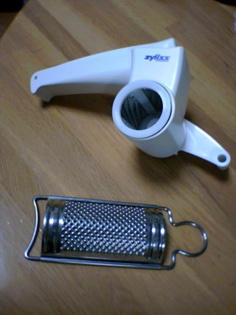

# [mixi] チリスのチーズグレイダー

**作成日:** 2006-03-31

前から欲しかったんですが、楽天のポイントがある程度たまったらにしようと決めてたので、しばらく待ってやっと購入。

送料がかかるので、何か一緒に買おうと思って「とぎジョーズ」も買ったので、本命はこちら。

昨日届いたんですが、届いたのが夕食後。

今日初めて使ってみました。

味付けを控えめにしてパスタを作り、仕上げにペコリーノ・ロマーノをたっぷり。食後に、意味なくパルミジャーノ・レッジャーノもおろしてみたり(笑)。楽しいなあ。

もともと使ってたチーズおろしより大きめに削れるみたいです。

飛び散らないしいいですよ～。

私が買ったのはここ。

http://item.rakuten.co.jp/add-kitchen/183-007/

って書こうと思ってお店をのぞいてみたら、「よくカエル」売ってるやん。チーズグレイダーを注文した時、よくカエルが在庫なしだったので、とぎジョーズ注文したのにー。

あー、買おうかな、どうしようかな。

---

## イイネ (11)

- きたまこと
- KOHJI＠掬水月在手
- ゆみちん
- まほ
- タク
- Buddy
- れてぃ
- arancio
- ケルマデック
- YASUO
- さぁ

---

## コメント

**マイリスト**

マイミク一覧

**チリスのチーズグレイダー編集する**

2006年03月31日22:34

**れてぃ2006年04月01日 04:52**

この手のはいいですよ。セミハードのチーズも卸せますし表面積が増えるのでグラタンなどには溶けやすくGOOD!ただ、卸しておいておくと固くなるし、カビやすいので御注意を。スパゲッティ・ブール・エ・パルミジャーノ等には、下の卸し金タイプが向いてます。

**arancio2006年04月01日 20:44**

たしかに、おろし金の方がチーズが細かいのでパルミジャーノなどはおろし金の方が向いてますね。
でも面倒だからやっぱりチーズグレーダー使っちゃうかも(笑)。
さて、今晩は何を食べよう。

**2026年**

01月
02月
03月
04月
05月
06月
07月
08月
09月
10月
11月
12月