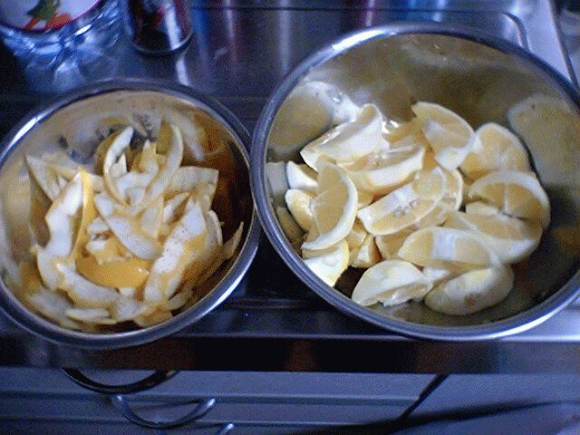
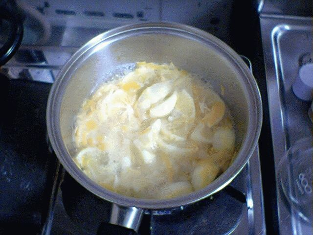
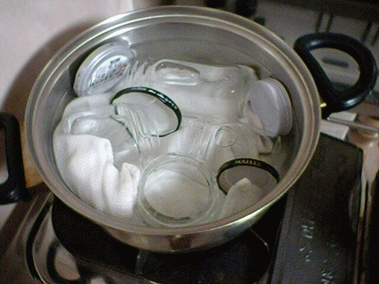

# [mixi] レモンマーマレードを作る

**作成日:** 2006-04-03

地物のレモンが5個で150円だったので何となく買ってしまった。

はちみつ漬けにでもしようかと思ってたのですが、5個もあるので、マーマレードを作ってみる。ジャム類は作るのは初めて。

レモンは4つ使う。

まず、くし形に切って皮をむく。けっこう大変。

剥いた皮は、苦みを抜くため2回ゆでこぼす。

その間に、果実から種を取り除いておく。

（レシピに何も書いてないので、種はとるものかどうかよくわからなかったけど、取ってみました。）

ゆでこぼした皮はきざむ。

面倒になって途中からは、大きめに ;-P

いよいよ煮込むのですが、水を入れるレシピと水なしでいきなり砂糖と煮込むレシピがあって、水を入れた方が簡単そうなので水を入れて煮込みを始める。写真は砂糖を入れる前。

その間に瓶を煮沸。

できあがりの分量がよくわからないので、とりあえず4つ準備。

---

## イイネ (9)

- きたまこと
- KOHJI＠掬水月在手
- ゆみちん
- まほ
- タク
- Buddy
- ケルマデック
- YASUO
- さぁ

---

## コメント

**マイリスト**

マイミク一覧

**レモンマーマレードを作る編集する**

2006年04月03日01:04

**2026年**

01月
02月
03月
04月
05月
06月
07月
08月
09月
10月
11月
12月
