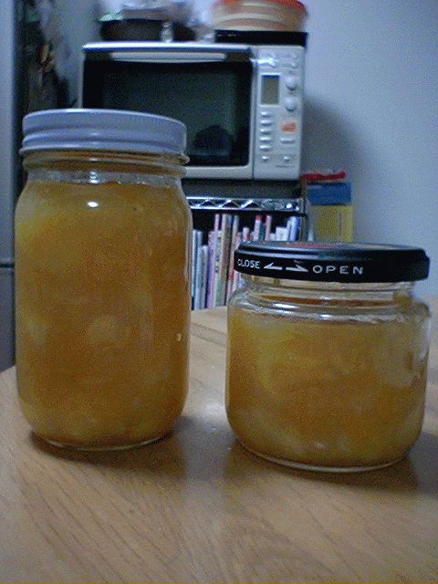

# [mixi] レモンマーマレード完成

**作成日:** 2006-04-03

作業開始から約1時間半後、ほどよくとろみがついてきたようなので、できあがったマーマレードを瓶につめる。

瓶は4つ用意したのですが、ちょうど2瓶におさまりました。

さて、この後、レシピによると、瓶ごと煮沸するか、蒸し器にかけるかするようだったので、さっき煮沸に使った鍋のお湯を減らして簡易蒸し器状態にして少し蒸して完成。

明日（寝坊しなかったら）朝食のトーストにつけて食べよっと。

楽しみ～。

---

## イイネ (9)

- きたまこと
- KOHJI＠掬水月在手
- ゆみちん
- まほ
- タク
- Buddy
- ケルマデック
- YASUO
- さぁ

---

## コメント

**マイリスト**

マイミク一覧

**レモンマーマレード完成編集する**

2006年04月03日01:13

**2026年**

01月
02月
03月
04月
05月
06月
07月
08月
09月
10月
11月
12月
