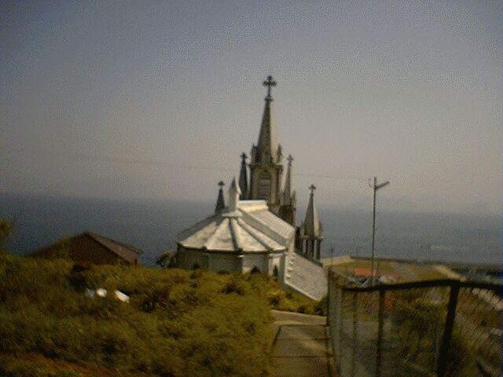
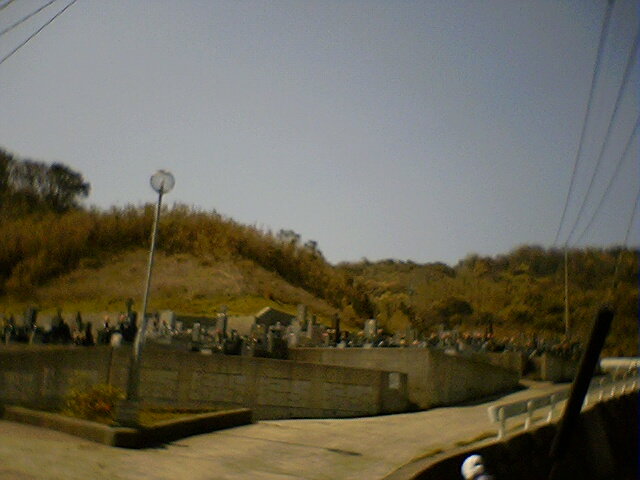
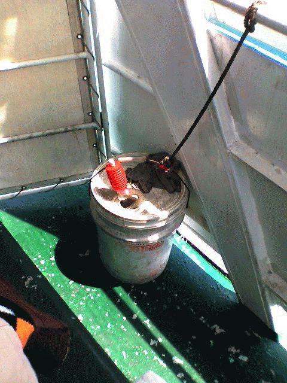

# [mixi] 伊王島でお散歩

**作成日:** 2006-04-10

土曜はキャンプ2日目、といっても特に予定している企画はなく、朝食後は自由時間。

私は沖ノ島天主堂まで散歩。伊王島には何回も行ってるのですが、この教会に行くのは初めて。思ってたよりこじんまりしてました。

帰りは行きと別の道を通って帰ったら、墓地があった。

長崎では、十字架の墓石を見かけることが多いのですが、近くで見たのは初めて。立派なお墓が多く、家紋と十字架が同じ石に彫ってあったり、聖書のことばが彫ってあったり、マリア像などがあったり、それぞれ凝った造りでおもしろかったです。

散歩の後、昼食の集合時間まで1時間以上残ってたので、暇つぶしにエステの30分コースにトライ。エステ初体験。悪くなかったけど、30分はちょっと短いですね。

お昼は公園でお弁当を食べて、乗船。

乗ったのは小さい船で、席が足りなくて船室ではなく、デッキに屋根をつけ座席にした部分にすわらされる。目の前の壁には「救命胴衣は船室にあります」と書いてあって、救命胴衣もない席だったらしい。横には謎の灯油缶が。なんなんだろうあれは。

無事に長崎港に戻り、帰宅したのが2時過ぎ。

---

## イイネ (9)

- きたまこと
- KOHJI＠掬水月在手
- ゆみちん
- まほ
- タク
- Buddy
- ケルマデック
- YASUO
- さぁ

---

## コメント

**マイリスト**

マイミク一覧

**伊王島でお散歩編集する**

2006年04月10日00:39

**2026年**

01月
02月
03月
04月
05月
06月
07月
08月
09月
10月
11月
12月
