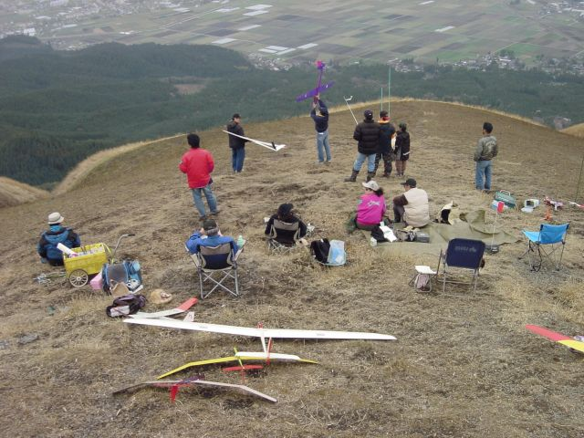
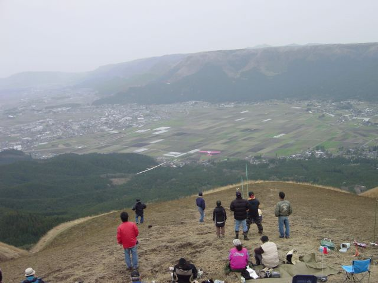
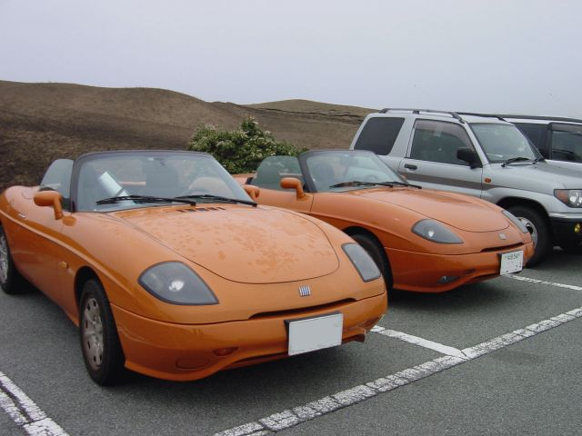

# [mixi] 大観峰

**作成日:** 2006-04-10

お花見オフの2日目(?)。

朝9時頃目を覚まし宿のお風呂へ。お風呂一人で独占。

前日の朝も、ひろーい伊王島の温泉、一人で入ってました。贅沢な気分。

きちんと朝食を食べ、11時前に解散。

遠方へ帰る人、別の花見に行く人、観光する人。

私はオレンジのバルケッタ（バルケッタのオーナーズクラブ「ラテン船舶信仰協会」略して「ラ船協」では「うにバル」と呼ばれます）2台で「一心行の大桜」を観に行くことに。

まずは大観峰へ。

曇りでしたが、たくさんの人。

写真を取り損ねましたが、駐車場には派手なペイントのガルウィング軍団がいて驚く。

展望台へ向かう途中。制服の二人連れとすれ違いました。

胸のところには「鑑識」と刺繍。背中には「POLICE」。

鑑識の人なんて、初めて見ました。何をしてたのかは不明。

あと、飛行機で遊んでる人たちがいました。

これ何ていうんでしょう？

離陸は紙飛行機みたいに投げてましたが、リモコンで操作してました。

三枚目の写真、手前が私のバルケッタ。

クリア剥げが進行して、痛々しいと言われてます。

---

## イイネ (11)

- マスター毛男
- きたまこと
- KOHJI＠掬水月在手
- ゆみちん
- まほ
- タク
- Buddy
- arancio
- ケルマデック
- YASUO
- さぁ

---

## コメント

**マイリスト**

マイミク一覧

**大観峰編集する**

2006年04月10日01:52

**マスター毛男2006年04月10日 02:14**

だいぶきてますなぁ＜塗装。やはりイタ車
全塗？

**arancio2006年04月10日 02:15**

ぼちぼち塗ってあげたいです。
お隣の車も同じ年式なんですけどねえ。

**2026年**

01月
02月
03月
04月
05月
06月
07月
08月
09月
10月
11月
12月