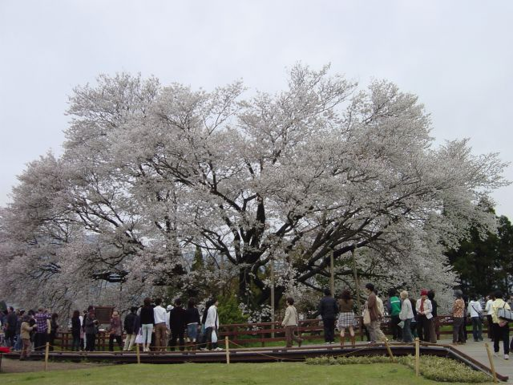
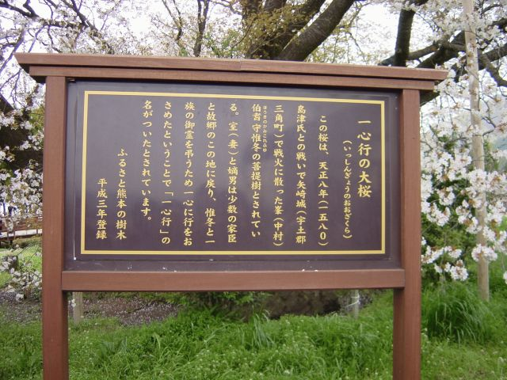
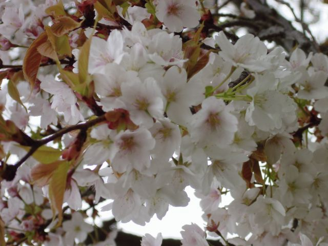

# [mixi] 一心行の大桜

**作成日:** 2006-04-10

大観峰を出て、草千里を抜け、南阿蘇へ。

ラリーかなんかをやってたらしく、ゼッケンをつけた変な車がいっぱい対向車線に。クライドも真っ青くらいに車種ばらばら。ミニみたいなかわいいやつから、スーパーカーみたいなやつ、ヒーレーもいてたなあ。ツーリング日和で、バイク軍団もやたら多い。

オープンカーの屋根開け率もほぼ100%。

オープンカーと行き違うとお互い手を振ってしまったり。

一心行の大桜はすごい人出で、駐車場へ入るのに30分くらいの渋滞。

でも、待った甲斐はありました。

近辺の桜もちょうど満開。

一心行の大桜以外にも、大きな桜の木を何本も見かけました。

---

## イイネ (9)

- きたまこと
- KOHJI＠掬水月在手
- ゆみちん
- まほ
- タク
- Buddy
- ケルマデック
- YASUO
- さぁ

---

## コメント

**マイリスト**

マイミク一覧

**一心行の大桜編集する**

2006年04月10日02:00

**2026年**

01月
02月
03月
04月
05月
06月
07月
08月
09月
10月
11月
12月
