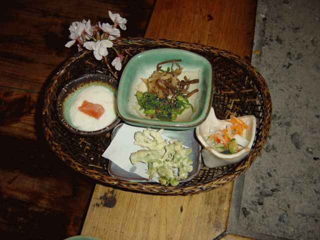
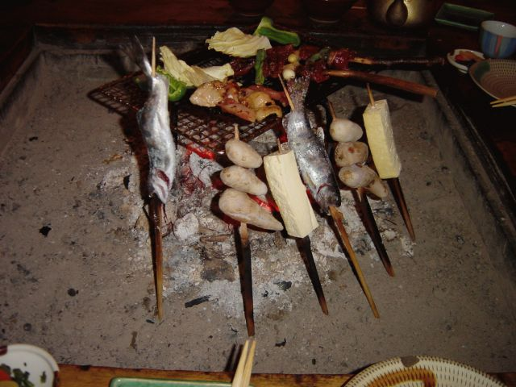
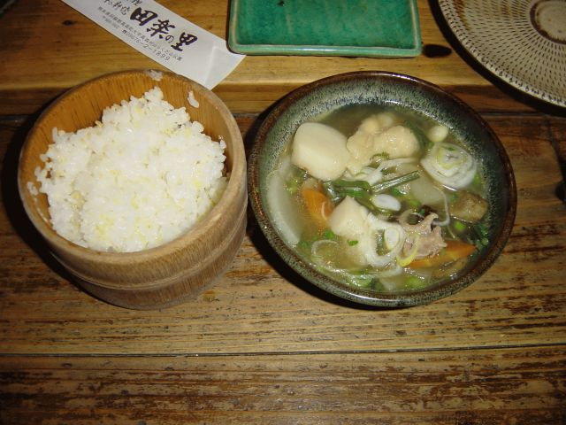

# [mixi] 田楽の里

**作成日:** 2006-04-10

一心行の桜にたどりついた頃にはお腹ぺこぺこ。

3時過ぎに駐車場を出たのですが、出る時に私がミスをして合流に時間がかかってしまいましたが、何とか再会して高森町へ田楽を食べに行きました。

お腹ぺこぺこの私が食べきれないくらいの分量の定食でした。

私が食べたのは田楽に地鶏焼きがプラスの山里定食1780円。

三枚目の写真はきびご飯とだご汁。

だご汁はちょっと食べてから写真を撮ってこの量。

やまめの塩焼きはおいしくてぺろっと食べちゃいました。

田楽の里を出たのが5時過ぎ。

福岡へ帰るゆきさんとお別れして、休憩がてらお風呂に入るつもりで瑠璃の里というところに行く。タオルを持たずに受付へ行って「タオルはあるんですか」と聞いたら「有料です」と言われ、車にタオルを取りに戻って、お腹いっぱいだし、明るいうちに帰ろうと思い直して阿蘇を後にする。

帰宅は10時過ぎ。

2日間の総走行距離は586kmでした。

---

## イイネ (9)

- きたまこと
- KOHJI＠掬水月在手
- ゆみちん
- まほ
- タク
- Buddy
- ケルマデック
- YASUO
- さぁ

---

## コメント

**マイリスト**

マイミク一覧

**田楽の里編集する**

2006年04月10日02:14

**2026年**

01月
02月
03月
04月
05月
06月
07月
08月
09月
10月
11月
12月
