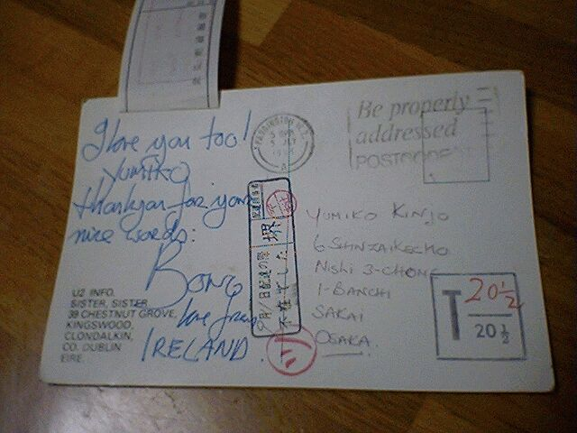
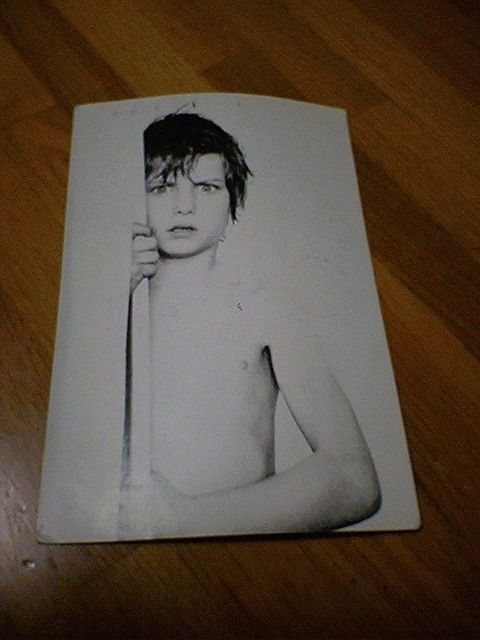

# [mixi] Bonoからのハガキ

**作成日:** 2006-04-12

こてつが千里セルシーのことを書いてたので、聴いてみたくなって当時のテープを捜索しました。残念ながらテープは見つからず、代わりに(?)Bonoからのハガキが出てきました。（年賀状・手紙の類は捨てたことがないので、小学生時代のものから残ってるはずなんで当然ですが）

消印は1984年7月5日。

U2の初来日の時で、厚生年金かフェスティバルでコンサートがあり、翌日くらいに新大阪まで友達2人と追っかけに行って、手紙を渡してきたのでした。

料金不足で210円とられてます。

当時もホンモノかなあと疑っていたのですが、どうなんでしょうねえ。ちなみにメンバーではドラムのラリーが一番好きでした。

その後、U2がアメリカで大ブレークし、20年以上も第一線で活躍するバンドになるとは思わなかったなあ。

アルバム War が一番好きだったので、アメリカに行ってからのU2はほとんど聴いてません。

---

## イイネ (11)

- マスター毛男
- きたまこと
- KOHJI＠掬水月在手
- ゆみちん
- まほ
- タク
- Buddy
- arancio
- ケルマデック
- YASUO
- さぁ

---

## コメント

**マイリスト**

マイミク一覧

**Bonoからのハガキ編集する**

2006年04月12日22:40

**マスター毛男2006年04月13日 11:09**

むかしベイシー亡きあとの2代目のリーダー、フランクフォスターに手紙おくったら返事返ってきた（部室にあるはず）のん、懐かしく思い出しました。

**arancio2006年04月13日 18:27**

送った手紙って誰が書いたん？

**2026年**

01月
02月
03月
04月
05月
06月
07月
08月
09月
10月
11月
12月