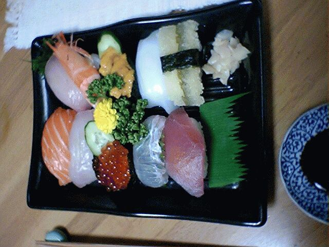

# [mixi] お寿司

**作成日:** 2006-04-17

今日はわりと早い時間にスーパーへたどりついたが、セールの日だったせいかわりと品薄。

一度、刺し身と寿司のコーナーを見に行って、それほど安くなかったので、野菜売り場へ行ってもう一度刺し身コーナーへ行ったら、値下げのシールを貼ってるところだった。

結局、588円のお寿司を買ってそれが夕食。だって、はじめに見た時は850円くらいだった1200円の特選寿司が最終的に588円ですから。

お寿司としてのクオリティはまあ置いとくとして、ネタはかなりおいしかったです。

---

## イイネ (12)

- きたまこと
- KOHJI＠掬水月在手
- ゆき
- まほ
- ゆみちん
- タク
- Buddy
- arancio
- ケルマデック
- YASUO
- さぁ
- イマホー

---

## コメント

**マイリスト**

マイミク一覧

**お寿司編集する**

2006年04月17日21:16

**イマホー2006年04月18日 00:18**

私のとって寝る前にこの写真を見るのは目に毒なんです。
と書きつつ、写真をクリックして拡大して見てしまった・・。

**arancio2006年04月18日 00:38**

心穏やかに眠れるよう祈っておきます。

**ゆき2006年04月18日 07:25**

うわあ・・・お寿司たべたくなるぅ☆ (>_<)

**arancio2006年04月18日 14:29**

博多にはおいしいお店たくさんありそうですね。
前に博多に行った時、三越の催事場で全国鮨の名店みたいなイベントやってたなあ。

**ゆき2006年04月19日 08:19**

あー☆ (^_^)　デパートの催事、大好き！
もれなく私も行ってます（笑）
その場で食べて、お腹いっぱいのくせにお土産に買って。
しかもまだまだ気になるのがあるもんだから
３日ほど通いつめる（笑）

**2026年**

01月
02月
03月
04月
05月
06月
07月
08月
09月
10月
11月
12月