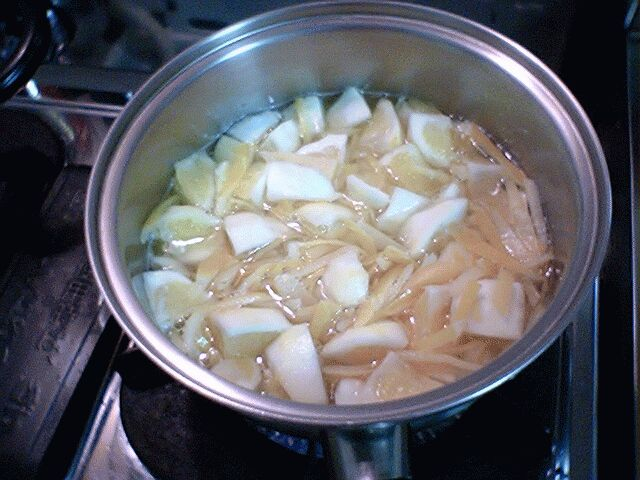

# [mixi] レモンマーマレード再び

**作成日:** 2006-05-02

先月作ったレモンマーマレード。

http://mixi.jp/view_diary.pl?id=111574912&owner_id=773882

http://mixi.jp/view_diary.pl?id=111581051&owner_id=773882

2瓶できて、ひとつは友達にあげ、ひとつは食べてしまいました。

これがけっこうおいしかったので、再度作ってみました。

皮もおいしかったけど、特においしかったのは、皮の内側の白い部分。ほろ苦くて、なんともいえない食感なのです。

前回の反省は、実は8等分しただけだったので、白い皮はおいしかったけど、パンに塗ったりするにはちょっと大きめだったこと。それから、逆に皮はもう少しあらめにきざんでも良かった感じ。

今回の改善点は、皮は塩水で軽くもんでみたこと、皮をゆでこぼしたお湯をペクチン液として使ったこと、皮はあらめにきざんだこと、白い皮つきの実は3つくらいに切ったこと。

大きめのレモン３つ420gとグラニュー糖150gで、3瓶のマーマレード完成。

---

## イイネ (11)

- きたまこと
- KOHJI＠掬水月在手
- まほ
- ゆみちん
- タク
- Buddy
- arancio
- ケルマデック
- でんじろう。
- YASUO
- さぁ

---

## コメント

**マイリスト**

マイミク一覧

**レモンマーマレード再び編集する**

2006年05月02日01:25

**でんじろう。2006年05月02日 20:52**

読んでいたらよだれが。。。
たべたあ～い♪

**arancio2006年05月04日 00:09**

食べに来てくださ～い。
今度のやつはとろっとした感じでジャムらしくできたんですが、白い皮のぷりぷり感は少なくて、どっちがいいかビミョーな感じです。

**でんじろう。2006年05月04日 00:17**

行きた～い♪
（ほんのちょっとだけ遠いけどっ。笑）

**2026年**

01月
02月
03月
04月
05月
06月
07月
08月
09月
10月
11月
12月