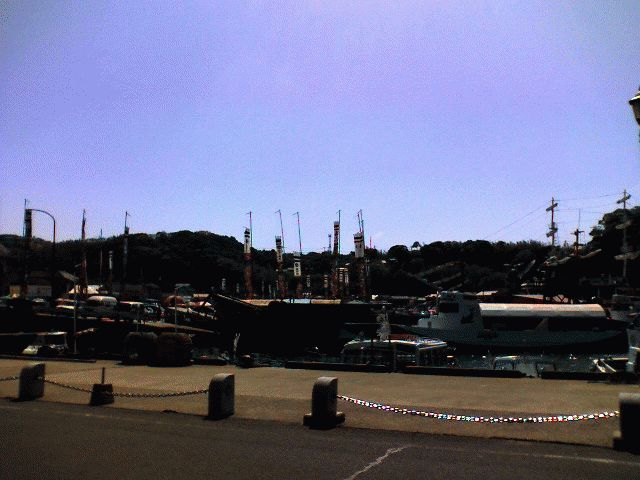
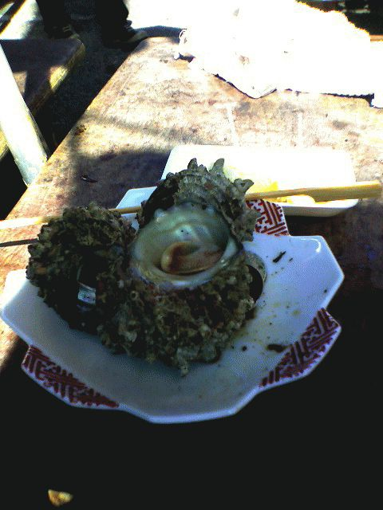
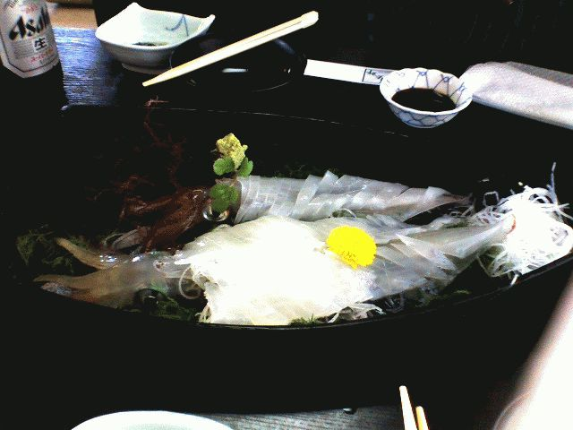

# [mixi] 呼子へ行く

**作成日:** 2006-05-03

連休初日、呼子へイカを食べに行きました。

渋滞は全くなし、多久まで長崎道で一直線、その後はゆっくり地道を走って約2時間で到着。

河太郎で待ち時間が2時間か3時間以上と言われるがとりあえず待ちの番号札をもらってぶらぶら。

まず鯨カツと魚コロッケを買い食い。

次にビールとさざえといかしゅうまい。

この辺で小一時間つぶれたので、河太郎へ待ち時間を聞きに戻ってみるとすぐに席に案内され「2時間待ちって一体？」となるが、店内で待ってる人もたくさんいたし、まあよしとしましょう。

いか刺し身定食を食べてきました。

福岡に住んでる頃、神戸から遊びに来た友達と初めて呼子の河太郎に行った時、刺し身醤油のあまりの甘さに二人で絶句したのですが、甘い醤油にもかなり慣れたようで、今日はそんなに違和感なく食べられました。

呼子の河太郎に行くのは3回目ですが、デザートがみかんじゃなかったのは初めて。今日はメロンだったのですが、最初に出たお吸い物ともずくの次に出てきて???でした。お吸い物はつきだしだったらしく、ご飯と一緒に赤だしのお味噌汁が出てきました。

生きてるうちに刺し身にされるわ、生きがいいのでおもしろがってつつかれるわ、刺し身の後は天ぷらにされるわ、イカにとってはまさに生き地獄でしょうが、きれいに食べるのが供養と思って完食してきました。

帰りは玄海町を抜けてのんびりドライブ。

驚くほど車がいませんでした。

---

## イイネ (9)

- きたまこと
- KOHJI＠掬水月在手
- ゆみちん
- まほ
- タク
- Buddy
- ケルマデック
- YASUO
- さぁ

---

## コメント

**マイリスト**

マイミク一覧

**呼子へ行く編集する**

2006年05月03日23:45

**2026年**

01月
02月
03月
04月
05月
06月
07月
08月
09月
10月
11月
12月