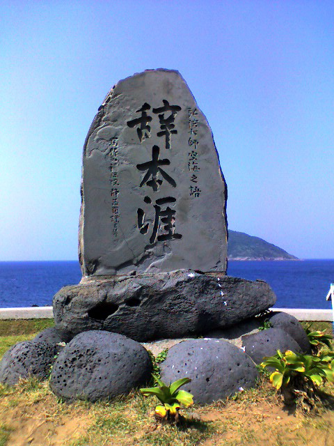
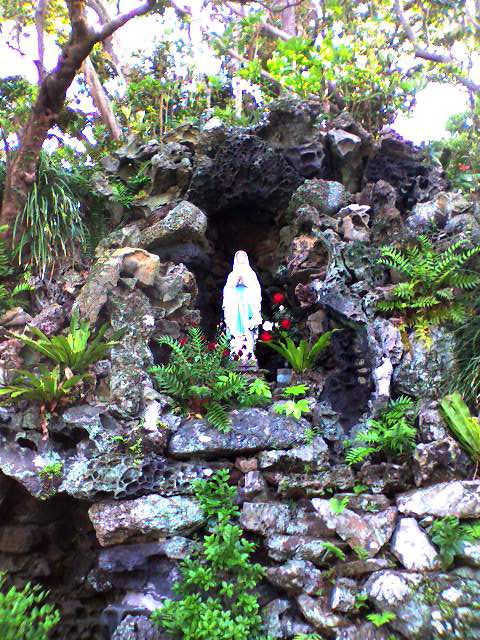
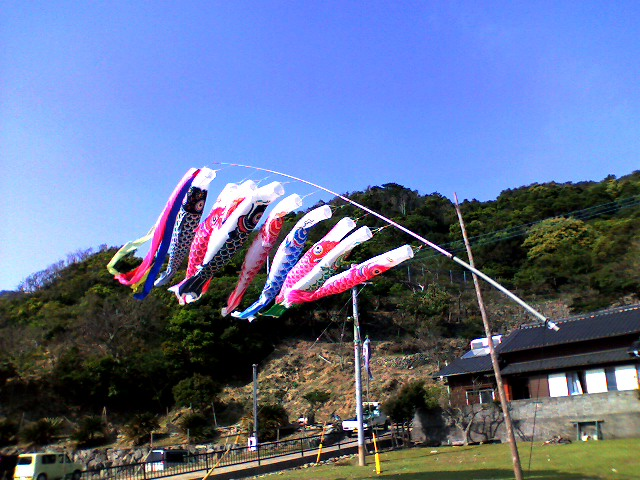

# [mixi] 五島へ行く

**作成日:** 2006-05-06

昨日から1泊で福江島へ行く。初めて行くので、オリエンタルエアブリッジを利用。プロペラ機に乗るのって、学生の時にグランドキャニオンでセスナに乗って以来のはず。

プロペラは驚くほど細いのが4枚。

回ってる時は高速すぎてほんとに見えない。プロペラの向こうの景色が常に見える。長崎空港を飛び立って30分足らず、あっという間に福江空港へ着く。

上空から見た福江島は思っていたより大きく、海がきれいで驚く。

到着してすぐ市内のレンタカー屋でヴィッツを借りてドライブに出発、と行きたいところですが、これが11時30分近く、福江を出るとお店などがないということで、まずは市内で腹ごしらえ。釜揚げうどんを食べる。まあフツウ。

福江の市街を出て、堂崎教会、魚津ヶ崎公園、水ノ浦教会、遣唐使ふるさと館、井持浦教会、空海記念碑「辞本涯」、島山島、大瀬崎灯台とまわって6時過ぎに福江に戻る。

どこも絶景といって良い美しさ、でした。

大瀬崎灯台は、駐車場から1kmちょっと下ったところにあり、行きは下り、帰りは登りで往復40分強ときつい道のりでしたが、行った甲斐はありました。

夜はホテルのフロントのお姉さんに教えてもらった居酒屋割烹に行く。ここは当たり。お酒の品揃えが良く、料理ももちろんおいしかったです。魚はどれもおいしかったですが、郷土料理のキビナゴのいり煮という鍋料理がおいしかったなあ。

カウンターにすわったので、水槽の魚達の寝床争いを堪能できました。

また来て下さいと、マスターに名刺もらって帰ってきました。

お客さんが店に雑魚寝で泊まったりするようなお店らしい...

スーパーでお水などを買ってホテルへ戻る。

物価は市内に比べ、やっぱり高めでした。

---

## イイネ (9)

- きたまこと
- KOHJI＠掬水月在手
- ゆみちん
- まほ
- タク
- Buddy
- ケルマデック
- YASUO
- さぁ

---

## コメント

**マイリスト**

マイミク一覧

**五島へ行く編集する**

2006年05月06日00:26

**2026年**

01月
02月
03月
04月
05月
06月
07月
08月
09月
10月
11月
12月
