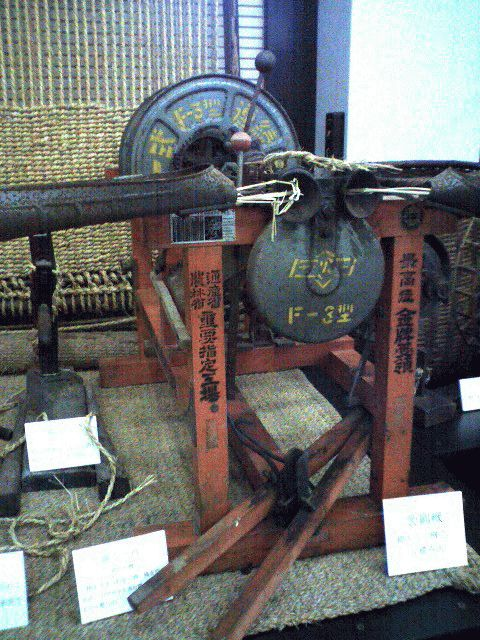
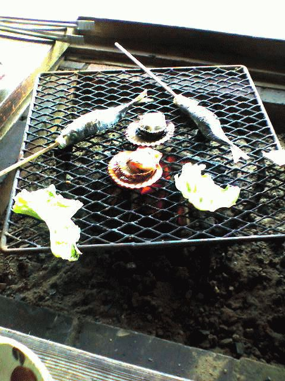
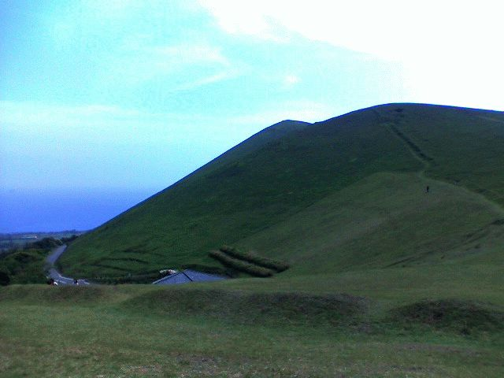

# [mixi] 五島2日目

**作成日:** 2006-05-09

5月5日、五島2日目。

ホテルの朝食が9時までだったので、それにあわせてぼちぼち動き出す。ダウンタウンというビジネスホテルに泊まったのですが、ここの朝食は地元の食材を使っているというのがウリらしく、おいしかったです。松山のトップインよりいいかも。

チェックアウトした後、福江城の跡地というか、城内の敷地にある五島観光歴史資料館へ行く。五島の歴史・文化がなんでもわかります。

資料館を出た後、町はもう観るところがなさそうなので、昼食を予約した椿茶屋がある香珠子海岸へ向かう。市内から15分くらい？

海岸を歩いたりして少し時間をつぶして、椿茶屋へ。

ここは五島観光の定番らしく、4日の夕食を予約しようと1日くらいに電話したら予約でいっぱいと断られたので昼食をとる事にしたのです。料理は、炭火で、魚介、五島牛を焼いて食べるというもの。

料理はおいしかったんですが、サービスがなくて、勝手に焼いて食っとけ的な感じで、ちょっと寂しかったです。ひおうぎ貝はタイミングよく殻をはずしに来てくれたので、サービスが悪いというのではないんですけどね。

食後は、コンカナ王国という温泉やら宿泊施設があるところへ行ってみたのですが、あまりに寒々しい雰囲気で早々に退散。鬼岳へ向かう。

鬼岳はハワイ型火山活動でできた山で、樹木がなく、芝生の山。

標高315m。車で登山口まで行って、プチハイキング。

下から見ると頂上に見えるところへたどりついたら、その向こうにまだ高いところが。さらにがんばって登ってみるが、頂上と思われるところに標高の表示などはなく、鬼岳と書いた金属のすごーくしょぼいプレートがあっただけ。海も見えるし、絶景でしたが。

鬼岳ハイキングの後は、溶岩が海に流れこんで独特の海岸がある鐙瀬ビジターセンターへ行く。自然お腹いっぱい状態だったので、近くにあった喫茶店で一休み。

それから町へ戻って買い物して、再びお茶して、空港へ。

空港で鬼鯖鮨というのを買ってそれが夕食になりました。

ぶあつーい鯖の身のお鮨です。こんなの。

http://www.cmcm.co.jp/NMK/008/008miraku.html

お取り寄せして食べてもいいクオリティでした。

一枚目の写真は、資料館にあった自動縄ない機(?)。

二枚目は椿茶屋にて。

三枚目は鬼岳。

---

## イイネ (11)

- きたまこと
- KOHJI＠掬水月在手
- ゆみちん
- まほ
- タク
- Buddy
- れてぃ
- arancio
- ケルマデック
- YASUO
- さぁ

---

## コメント

**マイリスト**

マイミク一覧

**五島2日目編集する**

2006年05月09日00:45

**れてぃ2006年05月09日 05:06**

三枚目の写真、めっちゃ綺麗ですね！

**arancio2006年05月09日 18:59**

ほんものは数百倍きれいでした。
五島は海も山も驚くほど美しかったです。

**2026年**

01月
02月
03月
04月
05月
06月
07月
08月
09月
10月
11月
12月