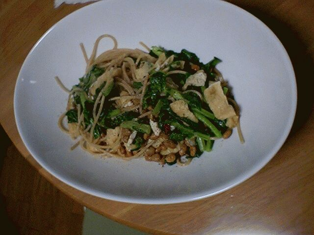

# [mixi] 全粒粉のパスタ

**作成日:** 2006-05-11

アルチェネッロの全粒粉パスタをちょっと前に初めて買ってみたのですが、少しもさもさした食感で、どんなレシピがいいのか、いまいちわからなかったのですが、やっと全粒粉のパスタにあうメニューを発見しました。

昨日、納豆と大根葉と油揚げの和風パスタを作ったら、これがぴったり。納豆のねばねばとパスタの食感のバランスがちょうどいい感じ。

料理は和食なら和食らしく、を心がけてるので、あまり和風パスタなどは作らないのですが、冷蔵庫の中身を減らすために作ってみたのでした。

せっかく見つけたレシピですが、全粒粉のパスタ使い切っちゃったので、しばらく再登場はないかな。

普段はだいたいディチェコのNo.11を食べてます。

---

## イイネ (13)

- きたまこと
- KOHJI＠掬水月在手
- jamaica
- ゆみちん
- まほ
- タク
- Buddy
- れてぃ
- arancio
- ケルマデック
- YASUO
- さぁ
- イマホー

---

## コメント

**マイリスト**

マイミク一覧

**全粒粉のパスタ編集する**

2006年05月11日01:24

**jamaica2006年05月11日 03:26**

今度教えてください！うまそなレシピ！

**れてぃ2006年05月11日 13:49**

納豆だめなんです。確かに、全粉粉のパスタ使いにくいと思ってたので、今度、オクラ、山芋使って試してみます。

**arancio2006年05月11日 13:58**

レシピというほどではないですが、1人前の作り方です。
1. パスタをゆではじめる。
2. オリーブオイル、にんにくをフライパンに入れて弱火で熱し、にんにくが色づいてきたら、きざんだ唐辛子を入れていったん火をとめておく。
3. パスタのゆであがり2、3分前に再度火をつけて、納豆1パック、油揚げ1枚をきざんだもの、大根の葉をざっくり（4,5cm程度）きざんだものを入れて炒め、納豆のたれと醤油で薄めに味付けをする。
4. 3にゆであがったパスタを入れ、塩加減を見て、ゆで汁を加えて味付け完了。仕上げにあらびき胡椒をふる。
こんな感じでしょうか。
にんにく、唐辛子はお好みの量で。

**arancio2006年05月11日 18:23**

＞れてぃさん
納豆だめですか。私も子供の頃は食べられなかったけど、今は大丈夫。きっかけは、うーん、特にない。
においがダメなら（私はそうだった）加熱すれば気にならないです。
納豆入りの味噌汁とかも食べやすいかも。
あとは、キムチ鍋に入れるとか。
豆嫌いだったら加熱してもだめだし、無理して食べる必要もないですが。

**イマホー2006年05月11日 22:42**

全粒粉パスタって難しいんですねぇ。健康に良さそうだからトライしてみようと思ってるんですが・・。

**arancio2006年05月11日 23:05**

フツーのパスタが白米なら、全粒粉パスタは玄米みたいな感じです。
同じ量なら、気持ち腹持ちがいいような気がします。
今のところ、納豆パスタに使うのが一番あってます。
ツナと野菜のパスタ、カルボナーラ、クリームパスタ、どれも今ひとつでした。

**2026年**

01月
02月
03月
04月
05月
06月
07月
08月
09月
10月
11月
12月
