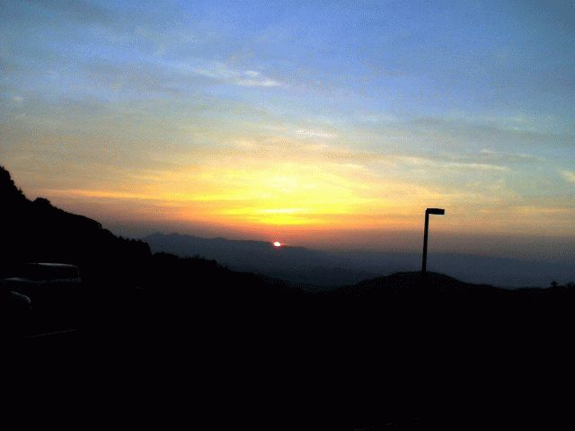
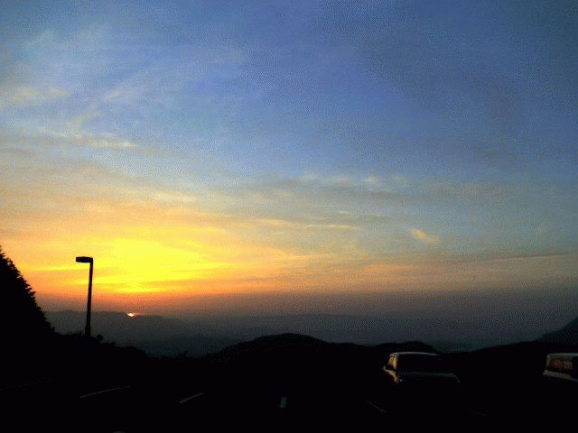

# [mixi] 夕焼け

**作成日:** 2006-05-11

帰宅しようと駐車場に出たら、ちょうど目の前の山に太陽が沈むところ。写真ではわかりにくいですが、海も見えるんです。

夕焼けを楽しみつつドライブして、帰宅しました。

---

## イイネ (12)

- きたまこと
- KOHJI＠掬水月在手
- ｱｷﾔﾏ(仮名)
- ゆみちん
- まほ
- タク
- Buddy
- arancio
- ケルマデック
- パテ
- YASUO
- さぁ

---

## コメント

**マイリスト**

マイミク一覧

**夕焼け編集する**

2006年05月11日23:36

**ｱｷﾔﾏ(仮名)2006年05月12日 00:31**

キレイですね。
このくらいになると太陽ってあれーって感じでスーッと消えてくと思うんですけど上手く撮れてますね。

**パテ2006年05月12日 00:41**

おおお　うつくしい
「三丁目の夕日」のＤＶＤ予約しよっと（違）

**arancio2006年05月12日 00:53**

PHSで撮った写真です。
雰囲気は出てるけど、ほんとはもっと、明るい感じだったなあ。

**arancio2006年05月12日 16:11**

＞パテさん
こないだ欽ちゃんの仮装大賞で「四丁目の夕日」見ました。

**パテ2006年05月13日 01:30**

え
なにそれ
「四丁目・・」
まさか建造中の通天閣が・・・・笑

**2026年**

01月
02月
03月
04月
05月
06月
07月
08月
09月
10月
11月
12月