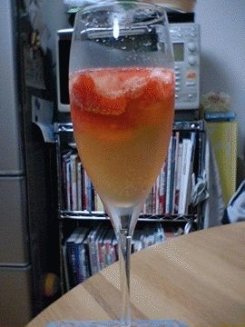

# [mixi] いちご、デコポン

**作成日:** 2006-05-18

ぼちぼちいちごの季節が終わりに近づいてるようで、大きいスーパーに行っても売ってなかったりする。

日曜にわざわざ遠くの農産物直売所へ出かけたのは、まだいちご売ってるかもと思ったからでした。ちゃんとありました。

小粒のさちのかを1パック買いました。200円。

春先はささやかな贅沢で、いちごを絶やさないようにしてました。

いちご、カバにいれて、カクテル風にしたりしてます。

すごく香りがいいです。

辛口のカバなので、もうちょっと甘口のスプマンテとかの方がいちごにはあうかも。

いちごはもう終わりですが、最近はデコポンが安く売ってます。

「みかんの王様」って書いてあったけど、初めて見た（笑）。

みかんよりは、オレンジに近い味で、みかけは悪いけど、外の皮も内側の皮もうすくて食べやすくておいしいです。

もう一枚の写真は直売所で買った切り花。

ぜんぶ緑なんですが、これは何ていう花なんだろう。

---

## イイネ (11)

- きたまこと
- KOHJI＠掬水月在手
- ゆみちん
- まほ
- タク
- Buddy
- れてぃ
- arancio
- ケルマデック
- YASUO
- さぁ

---

## コメント

**マイリスト**

マイミク一覧

**いちご、デコポン編集する**

2006年05月18日00:20

**れてぃ2006年05月18日 13:48**

もし、お持ちでしたらグランマニエというオレンジのリキュールを少し入れてみて下さい。ぐっと奥行きのある味になります。マーマレードの仕上げに垂らしても。

**arancio2006年05月18日 18:02**

持ってないので、仕入れます。

**れてぃ2006年05月18日 18:04**

仕入れるだけの価値あると思います。

**2026年**

01月
02月
03月
04月
05月
06月
07月
08月
09月
10月
11月
12月
