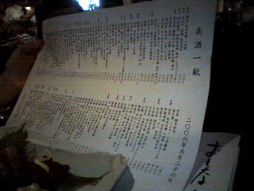
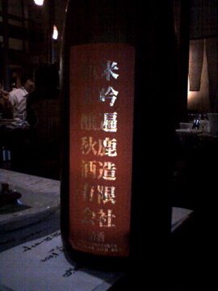
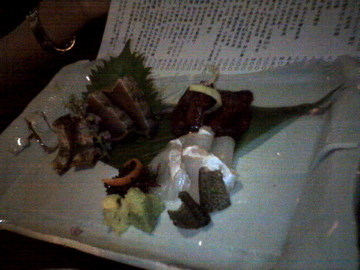

# [mixi] 佳酒真楽 まゆのあな

**作成日:** 2006-05-29

先週の金曜は、南船場の「まゆのあな」というお店に行きました。今月のdancyuに掲載されてるのを読んだ友人が行きたいということで、二人で新規開拓してきました。

山中酒の店直営ということで、日本酒がすごい品揃え。

それに安い。1杯90mlが250円くらいから。高いので1,000円くらい。

まず常陸野ネストの地ビールを1杯ずつ。

刺し身がきたので、さて日本酒は何にしようと店員さんにオススメを聞いてみる。「高いですけど」と言われたけど、酔う前においしいのを飲んでおこうということで、二人とも秋鹿の遍（あまね）一貫造り1,000円を飲む。おいしかった。ミョーに香りが高いとかそういう強い主張はないけど、滋味があるというか、すっとした味でした。

せっかく大阪にいるので、すすめられなくても秋鹿飲もうと思ってたんですが、遍はほんと驚くほどおいしかったです。

次のお酒は私は島根の王禄の原酒350円。島根のお酒って飲んだ事ない（と思う）ので飲んでみました。これもおいしかったです。友人は滋賀の大治郎250円。安かったけど、驚きのおいしさでした。

料理もあれこれ食べましたが、おいしかったです。

で、〆に「ご飯ものどうしようか～」と相談してたら、店員さんが「カレーは古酒をあわせておすすめしてるんですよー」というので、迷わずカレーと古酒を注文。古酒の銘柄は覚えてません。

カレーは、コラーゲンぷるぷるの魚（名前聞いたのに忘れてしまった）と蓮根団子などが入っていて、スパイシー。ちょっと甘みのある古酒によくあってました。

店員さんもみんな感じが良かったし、すごくいい店でした。

日本酒好きな方はぜひ行って下さい。

今日のビストロSMAPで吾郎ちゃんが日本酒の古酒とカレー出してたけど、はやってるのかなぁ？

写真はみにくいですが、品数の多さはわかってもらえるかと。

http://
www.yam
anaka-s
ake.jp/
mayu/in
dex.htm

---

## イイネ (15)

- きたまこと
- KOHJI＠掬水月在手
- けん
- おおせ
- ゆみちん
- まほ
- タク
- Buddy
- れてぃ
- arancio
- ケルマデック
- パテ
- でんじろう。
- YASUO
- さぁ

---

## コメント

**マイリスト**

マイミク一覧

**佳酒真楽 まゆのあな編集する**

2006年05月29日23:05

**でんじろう。2006年05月29日 23:59**

日本酒･･･かっちょええっすねー！
オトナやわぁ～♪（あ、歳かわらへんけど。笑）

**arancio2006年05月30日 00:10**

料理もおいしかったですよ～。

**おおせ2006年05月30日 02:48**

おいしそう！まゆのあな、写真見せて頂きました。建物も雰囲気の良いあったかな感じ。へっついご飯もあるのね。おいしい日本酒、それに合う料理>^_^<　とっても、とっても行って見たい！

**パテ2006年05月30日 03:42**

だんちゅ～マニアっすか！

**れてぃ2006年05月30日 12:40**

あまねは呑んだことないです。王禄の原酒も。大治郎はホント良いお酒ですね。古酒とカレーですか。未知の世界だ。五勺２５０円からっていいですね。一合と言っても八勺位しか入って無い所が多いですのに。

**けん2006年05月30日 15:09**

すげえ。
ここ行ってみたい。
秋鹿は奈良だっけ?
さかなのカレーもくいたい。

**arancio2006年05月30日 18:50**

＞おおせさん
そういえば、カレーのご飯がつやつやでやけにおいしかったです。へっついさんで炊いてたんですね。
＞パテさん
別にマニアじゃないと思います（笑）。
＞れてぃさん
遍、強くオススメします。
カレーはちゃんとスパイスがきいてたけど、あうんです。不思議。
＞けんちゃん
秋鹿は大阪の能勢で作ってます。奈良は春鹿ですね。
魚のカレーだったけど、東南アジア系のフィッシュカレーとは違った感じでした。うまく説明できないけど。

**2026年**

01月
02月
03月
04月
05月
06月
07月
08月
09月
10月
11月
12月
