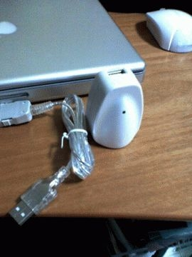
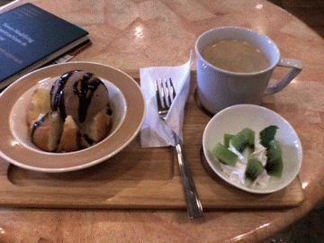

# [mixi] お役立ち小物とおやつ

**作成日:** 2006-06-04

今日も散歩に出かけるが、ちょっと探しものがあって、まずダイソーへ。

日頃持ち歩いているPHS、iPod shuffle、クリエがどれもUSBで充電できるので、携帯電話用の充電器が流用できないかと思って探しに行ってみました。PCがある時はPCで充電すればいいわけですが、充電のためにノートパソコンを持って歩くのは間違ってるし(笑)。

ありました。USBポートがついたACアダプタと、携帯用のケーブルがついて840円。アップルの純正はかっこいいけど、高いし大きすぎる。これはちっちゃくて、プラグもたためるし、満足。

帰宅後、全部ちょこっと充電してみたけど、問題なさそう。

DoCoMo用のUSBケーブルは誰かにあげよう。

ダイソーを出て、てくてく約20分。スーパーで買い物。

今年初めてびわを買う。おいしいかなあ。

買い物していつものパン屋のイートインへ。イートインメニューが変わってて、新メニューのアイスクリームとマフィンのセットを注文。1時間ほど読書して、帰宅。

---

## イイネ (11)

- きたまこと
- KOHJI＠掬水月在手
- ゆみちん
- まほ
- タク
- Buddy
- れい
- れてぃ
- arancio
- YASUO
- さぁ

---

## コメント

**マイリスト**

マイミク一覧

**お役立ち小物とおやつ編集する**

2006年06月04日18:36

**れてぃ2006年06月04日 23:54**

ダイソーの１００円オーバーの商品で魅力の有るものたくさん有りますもんね。

**arancio2006年06月05日 00:25**

300円は前から知ってたんですが、800円とかいろいろありました。
電子小物は、なかなか、あなどれないです。

**2026年**

01月
02月
03月
04月
05月
06月
07月
08月
09月
10月
11月
12月