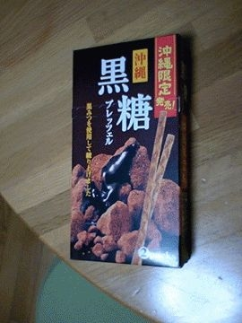

# [mixi] 黒糖プレッツェル

**作成日:** 2006-06-14

生協ではぷち沖縄フェアが続いている。

レジ前に小さいテーブルがあって、そこに沖縄関連商品が並べてあるので、レジ前に並んでる時につい手にとってしまうのだ。

今日は島豚ジャーキーと黒糖プレッツェルを買った。

黒糖プレッツェル初めて食べたけど、それほど甘くなく、黒糖の風味がしっかりしてておいしかった。

「沖縄限定」と書いてあるけど、作ってるのは岡山の工場みたい。

---

## イイネ (12)

- きたまこと
- KOHJI＠掬水月在手
- ゆみちん
- まほ
- KotetsU
- タク
- Buddy
- れい
- arancio
- ごみりん
- YASUO
- さぁ

---

## コメント

**マイリスト**

マイミク一覧

**黒糖プレッツェル編集する**

2006年06月14日22:29

**KotetsU2006年06月15日 11:41**

そこを見ては、夢は夢でなくなるのです・・・。
沖縄は、沖縄なのです！！
アメリカ土産が、中国製みたいなあ。。

**arancio2006年06月15日 13:57**

夢を壊しちゃってごめん。
見なかったことにします。

**KotetsU2006年06月15日 18:08**

沖縄、あー美味しー。
これですよ（笑）

**arancio2006年06月15日 18:22**

おいしいのは保証します！

**ごみりん2006年06月15日 18:24**

沖縄のお土産で”黒いウコン”をもらった・・・
黒いウンコみたいだった(^_^;)
ホントホントだって～～～
かりんとうみたいだったかな～

**arancio2006年06月15日 18:26**

黒いウコン、どうやって食べるんですか？

**KotetsU2006年06月15日 19:31**

粉末にしてから、
ティーバックに入れて、
お湯入れて、
それから飲むんじゃないですか？

**ごみりん2006年06月15日 19:56**

”かりんとう”（固形）みたいになってました。

**arancio2006年06月16日 11:08**

そのまま食べるみたいですね。
おやつ？
今度沖縄へ行ったら探してみよ。

**2026年**

01月
02月
03月
04月
05月
06月
07月
08月
09月
10月
11月
12月
