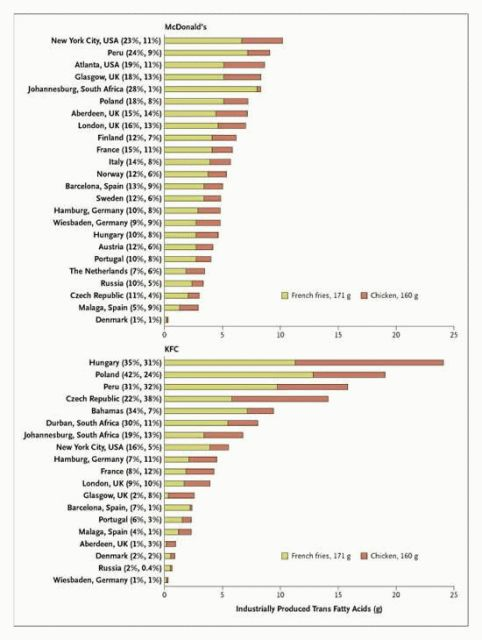

# [mixi] トランス脂肪酸

**作成日:** 2006-06-16

先日、ケンタッキーフライドチキンが悪玉コレステロールを増やす油の使用をやめるよう消費者団体から訴えられているという記事を見かけました。ゼミの学生がファーストフードについて調べているので、関連する記事を探してみたら、おもしろい記事がいろいろと見つかりました。

問題にされているのは、トランス脂肪酸という成分で、これは悪玉コレステロールを増やし、心臓病のリスクを増大させるそう。他にも、アトピーとかぜんそくとかぼけとかガンとか。

安全な量は0.5%以下で、デンマークでは食品に含まれる量を2%に制限していたり、アメリカ・カナダでは含有量の表示が義務づけられています。

図は下記の記事から持ってきた各国のマクドとKFCのチキンナゲットとフライドポテトのトランス脂肪酸含有量のグラフ。

http://www.newscientist.com/article/dn8989-fast-food-awash-with-worst-kind-of-fat.html

国によって全然違う。

国じゃなくて店によって違う、のかもしれませんが。

残念ながら上の調査に日本は入ってませんが、日本と同様トランス脂肪酸に関する規制がない台湾でファーストフードのトランス脂肪酸含有量を調べた結果の記事を読むと、マクドとKFCが1～5%だったのに対しモスバーガーは0.5%以下だったらしい。ぱちぱち。（日本も同じかどうかわかりませんが）

日本の食品のトランス脂肪酸含有量はこんな感じ。

http://www.food-safety.gr.jp/syokuhinhyouji/bunnsekikeltuka.htm

http://www.jccu.coop/news/syoku/syo_050413_01.htm

こんなんもありました。

http://www.j-margarine.com/newslist/news8.html

---

## イイネ (12)

- きたまこと
- KOHJI＠掬水月在手
- ながいけ
- ゆみちん
- まほ
- タク
- Buddy
- れい
- れてぃ
- arancio
- YASUO
- さぁ

---

## コメント

**マイリスト**

マイミク一覧

**トランス脂肪酸編集する**

2006年06月16日13:04

**れてぃ2006年06月16日 13:19**

勉強になります。

**arancio2006年06月16日 13:24**

補足です。
植物油とかマーガリンがあがってますが、植物性のコーヒーフレッシュとか、クリーマーもかなりやばい種類の製品みたいです。
摂取する総量は少ないけど、トランス脂肪酸含有量が10～15%だったりするようです。

**ながいけ2006年06月16日 15:25**

コーヒーフレッシュってなんでフレッシュて言うのか
意味わからなくてイライラします。
まともに見える喫茶店でコーヒーの脇に貧乏くさい
プラスチックの端っこをちぎるコーヒーフレッシュが
出てくるとイライラします。
トランス脂肪酸の件は全く安全な食品はありえないという
見地から別にいいやって感じですね。
こういうのを非難する文章に出てくる、
「自然界に存在しない物質」
という言い回しの根拠がわからなくてイライラします。

**arancio2006年06月16日 16:25**

イライラさせちゃったみたいですね。
ヨガで心を鎮めて下さい。
コーヒーフレッシュは嫌いなんで世の中から消えてなくなっても全然構わないなあ。

**ながいけ2006年06月16日 16:29**

同じくコーヒーフレッシュは嫌いなので使わないのですが、
使い回しされるのがイヤでフタだけプチッと開けることが
あります。こころが狭いんです。
ヨガに励みます。

**arancio2006年06月16日 16:35**

使わないのに、プチっと開けちゃったりしたら、こぼれて余計イライラを招く危険が...
ヨガうらやましいです。
精神性みたいなのが嫌いでヨガには近寄らなかったんですが、ピラティスとかパワーヨガとかは完全にスポーツみたいなんで、やってみたいような気がする今日この頃です。

**2026年**

01月
02月
03月
04月
05月
06月
07月
08月
09月
10月
11月
12月