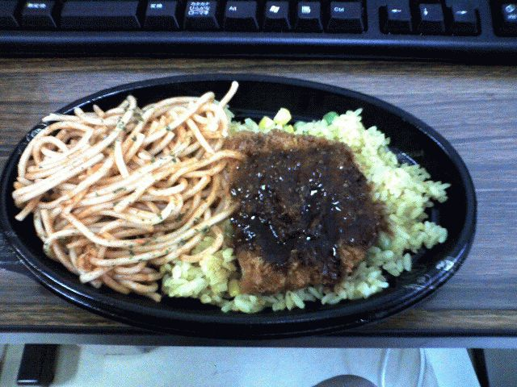

# [mixi] トルコライス

**作成日:** 2006-06-22

ちゃんぽんほど有名でない長崎名物に、トルコライスというのがある。ピラフの上にトンカツがのっててソースがかかってて、スパゲティが添えてあるという、いかにも飢えた若者のためのメニューです。

長崎にきて3年あまり、考えてみると、お店でトルコライス食べたのって一度しかありません。近所の学生向けの洋食屋さんで食べました。女の子向けのミニサイズみたいなのがある店でした。

最近、生協の弁当の新メニューにチキントルコプレートが登場し、一回は食べとかなあかんやろうことで、食べてみました。約800kcal。

野菜がほとんど入ってないので、伊藤園の「1日分の野菜」と一緒に。

わりとおいしかったです。

スパゲティが懐かしい味でした。

鶏肉がおいしいので、カツもおいしいし。

お弁当のは量が少なめだけど、お店のやつはもっとボリュームあるので、今後もトルコライスを食べる機会はあんまりなさそうです。

トルコライスのいろいろが見たい人はこちらへどうぞ。

http://
turkish
rice-ma
niax.ks
-depots
.com/

---

## イイネ (13)

- きたまこと
- KOHJI＠掬水月在手
- Jane Birkin
- ゆみちん
- まほ
- タク
- Buddy
- れい
- arancio
- パテ
- YASUO
- さぁ
- 退会したユーザー

---

## コメント

**マイリスト**

マイミク一覧

**トルコライス編集する**

2006年06月22日13:00

**パテ2006年06月22日 13:48**

こちら和歌山では（というか一軒しか見たことないけど）ドライカレーにとんかつ載せてカレーかけたものを「トルコライス」っていって出してましたな。
浪人サーファーパチプロ時代の主食でした。ああ懐かしい

**arancio2006年06月22日 14:05**

パテさんがサーファーでパチプロだったとは知りませんでした。
私が高校生の時に初めてバイトした喫茶店では、オムライスの上に、ヒレカツが２つか３つのってて、ドミグラスソースかけたのがトルコライスでした。
カレーのおいしい喫茶店でした。
何日かに一回大きい鍋でカレーを煮込むので、カレー作ってる日にバイトへ行くと全身カレーの匂いがしみついてたなあ。

**パテ2006年06月22日 17:31**

♪カレぇーのおいしいィ～きっさて～んっ♪
そなんす　高校時代締め付けられてた分　卒業して「浪人」名目で家でブラブラ。お袋が「ふうわりさけどっか行け」（世間体が悪いからなんか外でしてきなさい）と言われ
中学の先輩が「波乗り」していてついて行ったらハマリまして海が「非番」の時はパチンコかアレンジボール。当時は結構な収入になりましたよ。今みたいに「上限」のない時代でしたし。
でもその後調理師学校行きだして飲食や守衛バイトし始めると「実業」の充実感に感動。以来パチンコ関係は行かなくなりましたな。
トルコライスがあった喫茶店があったその田舎のデパートはいつしか閉店し今じゃ「パチンコ１２３」に。
これって輪廻転生っての？　ちゃうかｗ

**退会したユーザー2006年06月23日 00:07**

以前ＮＨＫの番組で河合我聞が路面電車が店のモチーフになってる店を紹介してましたよ。長崎の。そこも有名ですか？

**arancio2006年06月23日 02:39**

え、路面電車がモチーフの店？知りませんでした。
トルコライスの有名店って「ツル茶ん」しか知りません。
電車がモチーフと言えば、松山の桜三里のカフェトレインしか思い浮かばない私。
毎夏お世話になるカフェトレインの写真はこの辺に。
http://
onisan2
cv.hp.i
nfoseek
.co.jp/
cb2005/
cb20050
9.html

**Jane Birkin2006年06月23日 03:36**

ツル茶んで食べたよー！
定食が一皿に乗った感じだと思った(^ワ^)

**パテ2006年06月23日 05:31**

あ　　その「路面電車がモチーフの店」の件
前に話題に出た長崎なんとか祭り（めがね橋のある通りを使ったお祭り？）
ですね。

**退会したユーザー2006年06月23日 18:40**

中通商店街にある店だそうです。

**2026年**

01月
02月
03月
04月
05月
06月
07月
08月
09月
10月
11月
12月
