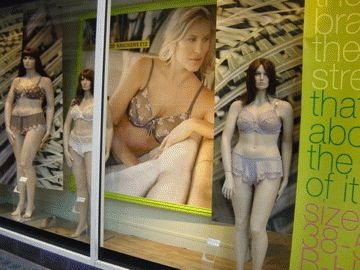
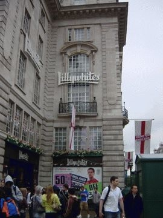
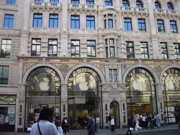

# [mixi] ロンドン その1

**作成日:** 2006-07-02

初めて行ったイギリス。

ヒースローに到着しての第一印象は、乗客も働いてる人もインド系が多い、でした。アメリカとはまた違った多民族ぶり。街を歩いてても、英語以外のことばがずいぶん聞こえてきました。

街は大都市という感じはなく、暖かい感じで、予想とずいぶん違っていましたが、一目で気にいりました。大きな道路も少なくて、人のサイズでできてる感じでした。

1枚目 街でみかけた太めのマネキン

2枚目 イングランド応援の旗

3枚目 アップルストア

---

## イイネ (13)

- マスター毛男
- きたまこと
- KOHJI＠掬水月在手
- ｱｷﾔﾏ(仮名)
- Jane Birkin
- ゆみちん
- まほ
- タク
- Buddy
- れい
- arancio
- YASUO
- さぁ

---

## コメント

**マイリスト**

マイミク一覧

**ロンドン その1編集する**

2006年07月02日21:28

**ｱｷﾔﾏ(仮名)2006年07月02日 23:53**

ボクも一度だけ歩いてまわったことありますが、確かに大都市という感じはしなかったですね。いろんな意味で落ち着いた感じがしました。
曇りと雨が多いのがたまにきず？

**Jane Birkin2006年07月03日 02:48**

うらやましかーーー(ﾟoﾟ)
ジョンレノンによろしく言っといて下さい。

**マスター毛男2006年07月03日 11:57**

アップルストア素敵♪

**arancio2006年07月03日 12:21**

＞アキヤマさん
ウィンブルドンの中継見てると突然雨が降り出しますが、幸い滞在中は天候に恵まれて雨が降ったのは1日だけでした。
からっとして、涼しく、気持ちよく過ごせました。
持って行った折りたたみ傘が崩壊したので、向こうで傘を飼いましたが。
＞Janeさん
ジョン・レノンにはあえなかったけど、ベッカムヘアの兄ちゃんは見ました。イギリスは男性が顔も、着こなしも、イギリスって感じで感心。ハンサムが多かった～。
＞マスター
かっこいいよね。
ただしMacユーザは超少数派で、Windowsを使用してる人が95%とロンドン大の技術スタッフのお兄ちゃんが言ってたけど。

**Jane Birkin2006年07月03日 15:55**

ベッカムですか！旬な話題！
今日はユニオンジャックのオールスター履いて同居人とお買い物に行きました。
同居人は「ENGLAND」と印刷されたベルト買ってました。
疲れた時はドトールで紅茶飲みました。
すべて本当です。
それくらい我が家はイギリスです間違いなくｗｗ
でもやっぱりうらやましか！！！

**arancio2006年07月03日 18:53**

＞Janeさん
ロンドン、物価高さえ（ほんとうに高い！）なければ本当にいいとこです。紅茶は安くとっても安く買えます。

**ｱｷﾔﾏ(仮名)2006年07月03日 20:26**

確かに高いですねー。前の会社時代に転勤の話があり真面目に色々検討したことあるのですが、特に家賃。
東京の1.5倍位？
あとヤングサンデーが5ポンド。高い。

**arancio2006年07月03日 21:11**

＞アキヤマさん
家賃は高いでしょうねえ。
本は消費税がつかないそうですが、高かったなあ。
地下鉄の初乗り3ポンドでした！640円くらい。信じられない。
ポンドって慣れてないので、10ポンドとか書いてあっても、10ドルくらいに思ってしまって、いやいや20ドルと同じくらいだとかややこしい計算してました。

**2026年**

01月
02月
03月
04月
05月
06月
07月
08月
09月
10月
11月
12月