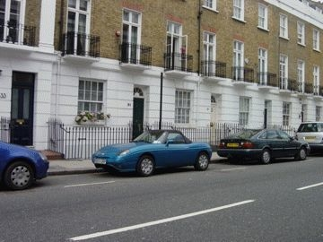
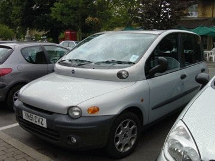
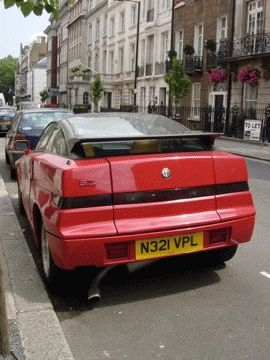

# [mixi] ロンドン その3 車事情

**作成日:** 2006-07-03

1週間ほどの滞在で、外にいる時は道行く車を眺めてましたが、「フランス車が多い」という印象でした。

日本でもプジョーはかなりの数走ってるけど、シトロエン、ルノーも多くてそれがフランス車が多いっていう印象になったんだと思います。一番多かったかも。

ベンツ、BMW、VWはまあ日本並みかそれ以上かな？アウディが日本に比べて目につきました。

イギリス車はそれほど多くなく、イタリア車も目立たず、日本車もあまり多くなかったです。旧ミニはぜんぜんいなくて、滞在中一度しか見かけなかったなあ。

で、バルケッタは2回見ました。写真のバルケッタはサウス・ケンジントンのあたりで。もう1回は新しいエンブレムの赤バル。

ムルティプラは3回くらいみたかなあ。

プントはけっこう走ってました。

3枚目の写真は変なマフラーのアルファ。

顔つきもいかつかったですが、後姿の方がインパクトがありました。

---

## イイネ (13)

- きたまこと
- KOHJI＠掬水月在手
- はっちゃく
- ゆみちん
- まほ
- タク
- Buddy
- れい
- れてぃ
- arancio
- YASUO
- さぁ
- 退会したユーザー

---

## コメント

**マイリスト**

マイミク一覧

**ロンドン その3 車事情編集する**

2006年07月03日21:56

**はっちゃく2006年07月03日 23:15**

あー、この真ん中の車～
こないだ大阪で見て「けったいな車やなぁ」と
思ったところです。

**arancio2006年07月03日 23:24**

イタリアでは、タクシーだったりして、そこそこ走ってると思います。

**れてぃ2006年07月04日 04:52**

右はSZですよね？なんか擦ってしまいそうなマフラーですね。

**退会したユーザー2006年07月04日 23:24**

てゆーかSZのマフラーは単に落ちかけているだけですな…．
旧ミニはイギリスではエンスーとかオシャレとかカワイイとかのイメージは無くて，単なる低所得者の証としてしか認識されてないらしいですが…．Mr.ビーンの愛車も旧ミニでしたねぇ．

**arancio2006年07月05日 00:25**

KITTENさん、ご教示ありがとうございます（笑）。
低所得者の証ねえ。さもありなん。
ロンドンの人はみんな金持ちに違いない。
イタリアの郊外では現役のチンクをたくさん見ました。
これもオシャレとかではなさそう。

**2026年**

01月
02月
03月
04月
05月
06月
07月
08月
09月
10月
11月
12月
