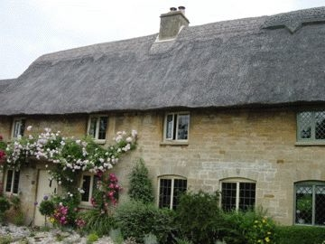
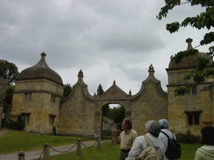
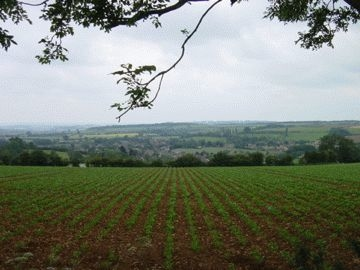

# [mixi] ロンドン その4 郊外へ

**作成日:** 2006-07-05

仕事でオックスフォード滞在中の先生とコッツウォルズ1日観光。

フィリップというガイドさんがミニバンを運転しつつ、しゃべりまくるというツアー。地図に載ってなさそうな田舎道をけっこうなスピードで走り、名所をまわる。彼がいうには、ロンドン発のツアーだと大型バスで商業化されたところをまわるので良くないとか。このツアーを選んだ私たちは"good taste"と褒めてもらった。（私は誘われただけなんだけど）全くお店のない静かな村へも行ったので、それはその通りかも。

アメリカ、西海岸のカーメルなんかでも素敵な街と思ってましたが、歴史が違うというか、ほんものの田舎の村と田園風景でした。

王様が領地をあげたり、ローマ人が道路を作ったり、歴史満載。

田舎の風景にも、ガーデニングにもさほど興味がない私でも感動。

6カ所ほどまわって、夕方解散。

1日で180kmくらい走る欲張りなツアーでした。

参加費が30ポンドだったけど、このツアーは価値があったなあ。

ツアー解散後、オックスフォードの街もちょこっとうろうろしました。こちらも、素敵なとこでした。大学の街だけあって、本屋がいっぱいあった。本屋に寄る時間がなかったのが心残り。

1枚目　昔は貧乏人の屋根だったが、今はお金持ちしか維持できない藁葺き屋根のおうち

2枚目　チッピングカムデンにて　こんな感じで説明を聞く

3枚目　田園風景

---

## イイネ (9)

- きたまこと
- KOHJI＠掬水月在手
- ゆみちん
- まほ
- タク
- Buddy
- れい
- YASUO
- さぁ

---

## コメント

**マイリスト**

マイミク一覧

**ロンドン その4 郊外へ編集する**

2006年07月05日00:05

**2026年**

01月
02月
03月
04月
05月
06月
07月
08月
09月
10月
11月
12月
