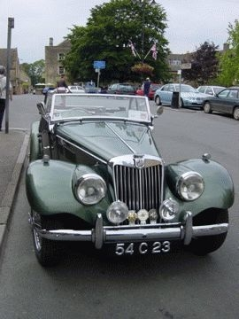
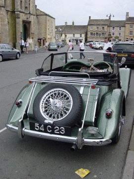
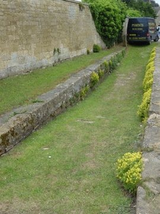

# [mixi] ロンドン その5 旧車

**作成日:** 2006-07-05

ロンドンの町中では、オースティン型の丸っこいタクシーがいい感じでしたが、旧車はほとんど見かけませんでした。

青バルを見た直後に、きれいな縦目のベンツを運転してるおじいちゃんを見かけたくらいかなあ。

あと珍車は、滞在中2回もフィガロを見たのが私にとっては驚きでした。イギリスでも売ってたのかなあ。なかなかいい雰囲気でした。

写真は今回見たほとんど唯一の旧車。

郊外ツアーで行ったストウオンザウォルドという街の広場に停まってました。

3枚目の写真は、チッピングカムデンで見かけた昔の○○○です。

ガイドさんの出題です。

---

## イイネ (12)

- マスター毛男
- きたまこと
- KOHJI＠掬水月在手
- ゆみちん
- まほ
- タク
- Buddy
- れい
- れてぃ
- arancio
- YASUO
- さぁ

---

## コメント

**マイリスト**

マイミク一覧

**ロンドン その5 旧車編集する**

2006年07月05日01:22

**れてぃ2006年07月05日 05:20**

トイレ？

**マスター毛男2006年07月05日 11:01**

ボーリング場？

**arancio2006年07月05日 11:49**

残念！どちらも違います。
他に答えはないでしょうか？
ヒント 車に関係があるといえばある

**arancio2006年07月10日 20:37**

あ、答え書かないと。
昔の洗車場だそうです。
水をためておいて、馬車などを走らせ、車輪をきれいにしたそうです。

**2026年**

01月
02月
03月
04月
05月
06月
07月
08月
09月
10月
11月
12月