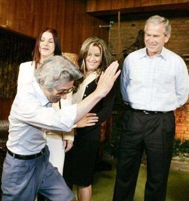

# [mixi] 恥を忘れた、狂気の、不気味な日本人

**作成日:** 2006-07-05

国内の報道は控えめだったけど、まあ、海外の報道の方が妥当ですね。ミサイルが飛ぼうかっていう時にこんなんじゃ。

http://
hiddenn
ews.coc
olog-ni
fty.com
/gloomy
news/20
06/07/p
ost_47d
5.html

こっちでもネタになってる。

なるよね、絶対。

http://
www.aur
altimes
.com/06
0703

ミサイル飛んできたし。

写真はエルビスの空手チョップのモノマネ？元記事はこちら。

http://
news.sc
otsman.
com/lat
est.cfm
?id=957
672006

---

## イイネ (12)

- きたまこと
- KOHJI＠掬水月在手
- 塾長
- ゆみちん
- まほ
- タク
- Buddy
- れい
- れてぃ
- arancio
- YASUO
- さぁ

---

## コメント

**マイリスト**

マイミク一覧

**恥を忘れた、狂気の、不気味な日本人編集する**

2006年07月05日11:38

**塾長2006年07月05日 12:25**

まあ、ワシントン・ポストのピーター・ベーカーの元記事は確かにあまり好意的ではないですね。興味深いのは英タイムズ紙リチャード・ロイド・バリーの実際の特派員ブログに寄せられた読者コメントは全体的に小泉に非常に好意的です。遠謀と皮肉を込めた政治的意思表示といったニュアンスのコメントが結構あってびっくりしました。まあ、いかにもいかにもイギリス人の小粋なユーモアを感じますがね。
でも、暗いニュースリンクのブッシュ一家の犯罪歴はわかりやすく、一般の人にも読みやすいんではないかな。
http://
hiddenn
ews.coc
olog-ni
fty.com
/gloomy
news/20
04/03/p
ost_14.
html
です。

**れてぃ2006年07月05日 13:11**

うーむ、確かに。

**arancio2006年07月05日 23:26**

＞塾長
読者コメント確かに好意的ですね。
Jun-chan人気者なんだ。
大統領選挙の不正についてはBBCのドキュメンタリーを見た記憶がありますが、あきれるしかないですね。

**塾長2006年07月06日 00:13**

ＢＢＣならグレッグ･パラストですね。アメリカ人だけど国内で活動できないからイギリスに居るはず。不正についての詳しい記述は彼の著書｢The Best Democracy Money Can Buy｣にあります。また上のリンクも是非（笑）

**2026年**

01月
02月
03月
04月
05月
06月
07月
08月
09月
10月
11月
12月
