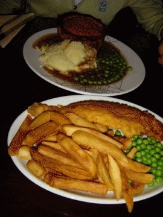
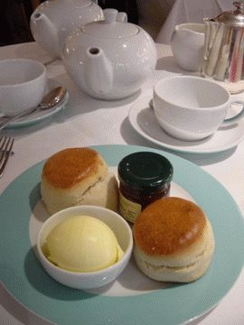
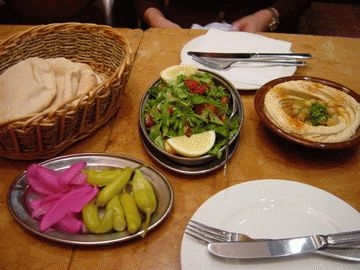

# [mixi] ロンドン その7 食べ物

**作成日:** 2006-07-10

今回は関空往復で、全行程、関西在住の先輩とご一緒しました。

行きの飛行機から女二人ずーっとしゃべりっぱなし、の旅行でした。

会議の出席者でよく知ってる人といえば、ゲストスピーカーの先生お二人だったのですが、先生方は仕事の都合などで私達より2,3日前にロンドン入りされてました。B&Bの朝食以外、ひどい料理しか食べてない、と嘆いてはったんですが、私たちはひどい料理にあたることもなく、幸せな食生活を送ることができました。

到着してまずパブ。滞在中3回行ったかな。

マッシュポテトはまずかった（インスタント？）が、フィッシュ＆チップスはおいしかった。「今日のパイ」というのを頼んだら、予想の3倍くらいのサイズで食べきれませんでしたが...

3日目は会議の昼食として、サンドイッチいろいろ。そんなに悪くなかった。チャツネとチーズのサンドがイギリス名物だそう。

夜は、ガイドブックに載ってたインド料理店でカレー。

メインのカレーとサイドディッシュを選ぶセットみたいなのを注文しましたが、洗練された味で、値段もお手頃。二人で30ポンド弱。

疲れてたのでお酒は飲まなかったのですが、店員さんにすすめられて飲んだスイカジュースがおいしかったです。

翌日の夕食はイタリア料理。

デパートのフードコートみたいなところで食事するつもりがオーダーストップみたいなことを何回か言われて彷徨い歩いてたどりついた店。店の窓にはカーテンがかかってて店内が全く見えなくて、メニューだけみて「えいっ」と入った店でしたが当たり！地元の客っぽい人でほぼ満席。

パスタの量が多くて（日本の1.5倍くらいあった）、食べきれなかったけど、料理もおいしかったし、サービスも良くて満足。

結局、滞在中一番のごちそうはここでした。二人で57ポンドくらい。

オックスフォードではガイドのフィリップさんおすすめのビストロへ。あひるのオレンジ風味煮込みみたいなのを食べました。お店のお兄さんにおすすめは何？と聞いたら "Snails"と言われたので、かたつむりも食べました。ここは4人で行ったのでワイン1本あけても一人17ポンドくらいだったかなー。

安くて、おいしかったけど、普段食べない脂っこいものをたくさん食べちゃって、夜中に気持ち悪くなりました。とほほ。

ロンドン最後の晩餐は、レバノン料理。ホテルの近くにたくさんあったので、テキトーに入ってみました。レバノン料理屋の多くは外にもテーブルがあって、そこでは水タバコを楽しんでる人が多数。（お金を払って吸ってるのか、システムがよくわからなかった）

ハモス（ひよこ豆のペースト）とサラダと鶏の炭火焼きを頼むと、ピタパンみたいなのとつけものっぽい酢づけの唐辛子と赤い大根みたいなのが出て来た。メニューにアルコール類はない！ので、スパークリングウォーターを頼んでぱくぱく。量も適度で、安くておいしかったです。二人で25ポンドくらい？

お昼に中東料理のファーストフード店みたいなのにも行ったけど、それもおいしかったです。

ということで、格安とはいえないですが、ロンドンもそこそこの値段でおいしいものが食べられます。ちなみにビールは1パイント3ポンドちょっとでした。

1枚目　フィッシュ＆チップスと謎のパイ

2枚目　フォートナムメイソンのスコーン

3枚目　ハモスとピタパンとつけもの

---

## イイネ (9)

- きたまこと
- KOHJI＠掬水月在手
- ゆみちん
- まほ
- タク
- Buddy
- れい
- YASUO
- さぁ

---

## コメント

**マイリスト**

マイミク一覧

**ロンドン その7 食べ物編集する**

2006年07月10日23:07

**2026年**

01月
02月
03月
04月
05月
06月
07月
08月
09月
10月
11月
12月