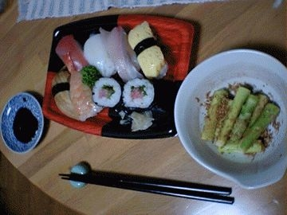

# [mixi] 299円！

**作成日:** 2006-07-11

最寄りのスーパーのお鮨。食べたことありませんでした。

半額だったので、買ってみました。299円。

シャリはそれなりでしたが、ネタは予想以上の質。

あなごはやわらかくておいしかったし、えび、いかはとろっと甘いし、ひらす(かな?)はこりこりと歯ごたえが。ちょっと感動。

---

## イイネ (13)

- きたまこと
- KOHJI＠掬水月在手
- けん
- ゆみちん
- まほ
- タク
- Buddy
- れい
- れてぃ
- arancio
- ぷち
- YASUO
- さぁ

---

## コメント

**マイリスト**

マイミク一覧

**299円！編集する**

2006年07月11日22:03

**けん2006年07月11日 23:34**

うまそう。
598円でも安いね。

**ぷち2006年07月12日 01:50**

ありえない安さです！
これだから九州って…
好き（笑）

**arancio2006年07月12日 12:50**

＞けんちゃん
598円でも文句なしです。
＞ぷちさん
福岡にも以前住んでて安いと思ってましたが、長崎はさらに安いですね。魚も野菜もおいしいし。
コンビニが不当に高く感じます。

**れてぃ2006年07月12日 16:47**

いいですね、海の近く。おいしいお寿司たべてないなぁ。週末作ろうかな。

**2026年**

01月
02月
03月
04月
05月
06月
07月
08月
09月
10月
11月
12月