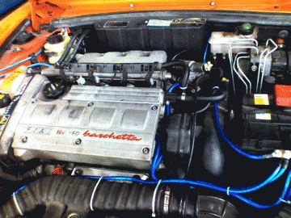

# [mixi] アーシング完了

**作成日:** 2006-07-16

アーシング完了しての感想です。

・エンジン音が静かになった。

・アイドリングが1,000くらいになった。前は1300～1500くらいだったと思う。

・車が軽く感じるので、ちょっとパワーがあがった？

アーシングキットとか色々売ってますが、よくわからないので、全部おまかせでキット 8,500円、工賃10,000円、消費税入れて合計　19,425円でした。

おまけのハプニングが一つ。

工場の人が、ボンネットを開けるプラスチックレバー（ひよわーいやつ）を折っちゃったそうで、クレームで部品取り寄せてつけてもらえることになりました。いつ折れてもおかしくないと思ってたので、折ったのが私でなくてラッキーでした。

あんまり意味ないですが、とりあえず写真。

ちゃんと真上から撮るべきでした。

レバーなしでボンネット開くかどうか試してみよう。

---

## イイネ (12)

- きたまこと
- ほいほい
- KOHJI＠掬水月在手
- ゆみちん
- まほ
- タク
- Buddy
- れい
- arancio
- YASUO
- さぁ
- テル

---

## コメント

**マイリスト**

マイミク一覧

**アーシング完了編集する**

2006年07月16日19:41

**テル2006年07月16日 23:07**

おお～、火花ぱちぱちと具合よさそーっすね！
クルマへの愛情ですねえ。

**arancio2006年07月16日 23:26**

調子いいような気がします。
愛はたっぷりありますが、塗装はボロボロです。

**ほいほい2006年07月17日 17:33**

そろそろあらいさんに相談しながら次の色を決めましょう(^^;
あえて同じ色でオールペンというのもアリかも知れませんね。

**arancio2006年07月17日 20:04**

同じ色で考えてるんですが、どの程度お金をかけるかが問題です。
上は40万コース、下が10万円くらい？
妹のだんなさんが赤いアルファに乗ってて、格安で同色に塗り直しました。名古屋まで持っててたけど。
20万円くらいで何とかならないかしらと思ってるんですが...

**2026年**

01月
02月
03月
04月
05月
06月
07月
08月
09月
10月
11月
12月
