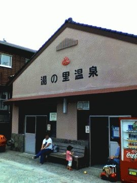
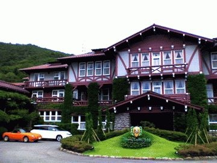

# [mixi] 夏のドライブ その1 雲仙

**作成日:** 2006-07-16

昨日は、島原の高校へ出前講義に行ってました。

10時集合で、講義をして、出されたお弁当を食べ、高校を出たのが12時半頃。そのまま帰るのはもったいないので、ドライブに行く事にしました。

島原半島へはちょくちょく行ってるので、フェリーで天草（熊本県です）へ渡ろうかなと思ったのですが、このところの猛暑でやっぱり涼しいところがいいなと思って、とりあえず雲仙に行ってみることに。

雲仙は避暑地として開発されただけあって春先だったら寒いくらいのところなのですが、残念ながら期待したほど涼しくなかったです。おまけに下界はピーカンだったのですが、山の上は曇りで今ひとつの天気。

とはいえせっかく上がったので、共同浴場の新規開拓。

100円！払って入る「湯の里温泉」というところに行ってみました。いいお湯でしたが、暑かったのと、ほんとに湯船があるだけのシンプルな温泉で間がもたなかったのでちょっとつかって、すぐ出てしまい受け付けのおばちゃんに「早かったですねー」と言われてしまった。

お茶でも飲んで休憩するつもりで、雲仙観光ホテルへ。

ここは外国人向けに建てられたクラシックホテル。

窓際に座ってると外から涼しい風が吹いてきていい気持ち。

原稿の赤入れをしたりしつつ1時間くらい休憩。

地図を持っていって、次はどこへ行こうかと考えたのですが、帰るのももったいないし、島原半島は行きたいところがないので、やっぱり天草へ行く事に。

バルケッタをオープンにして、3時過ぎにホテルを出て、島原半島の南端、口之津のフェリー乗り場を目指す。少し山を降りたら、やっぱり晴れてました。

---

## イイネ (9)

- きたまこと
- KOHJI＠掬水月在手
- ゆみちん
- まほ
- タク
- Buddy
- れい
- YASUO
- さぁ

---

## コメント

**マイリスト**

マイミク一覧

**夏のドライブ その1 雲仙編集する**

2006年07月16日21:35

**2026年**

01月
02月
03月
04月
05月
06月
07月
08月
09月
10月
11月
12月