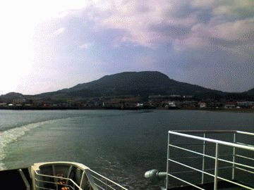
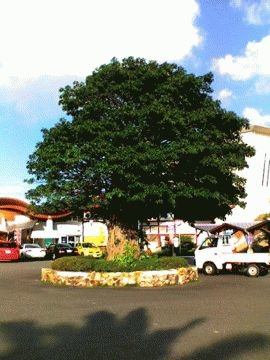
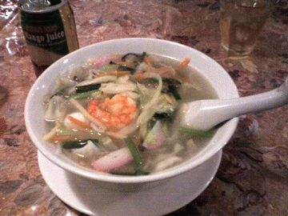

# [mixi] 夏のドライブ その2 天草

**作成日:** 2006-07-16

島原半島の南端の口之津港に到着したのが4時前。

4時15分発のフェリーに乗れました。

料金1,950円、安い！

船室はクーラーが効き過ぎだったので、デッキで景色と地図を交互に見ながらその後のルート検討。

天草は北側の天草上島と南側の天草下島があり、フェリーも口之津と鬼池を結ぶもの以外に、島原港へ行くやつとか、長崎市内へ直接向かうのもあります。

ちょっと悩んだのですが、長崎市内へ直接戻るのはなんだかもったいないし、島原半島へ戻るのもいやんなので、夕景も楽しめそうだし、とにかく西の海岸沿いを熊本市を目指して走ることにしました。

30分で、天草下島の鬼池港に到着。

到着してすぐ来て良かった！と思いました。

空気も光の色も違ってました。

道路沿いの街路樹も幹がつるっとした感じの見た事がないやつで、へぇーって感じ。

下島から上島へ行く橋を渡るのが少し混雑してたくらいで後はひたすら順調。途中、道の駅有明で妹に頼まれた「こっぱ餅」を購入。

道中、お葬式っぽい服装をした7,8人の人が2mちょっとくらいの棒に紙のかざりがついたのを持った人たちを見かけたんですが、あれは何だったんだろう？

6時頃、天草上島を出る橋にたどりつきました。夕焼けにはまだ早かったけれど、西日のあたる海に小さい島々が浮かんで、とてもきれいでした。BGMはキムサクの「繋がれた碧」。ちょっとうるっとくるくらいキレイでした。無神論者ですが、これって神様からのプレゼントかなあと思ったくらい。

7時半くらいに熊本市内に到着。

お腹がすいてたけど、熊本の繁華街へ行って食事する元気もないし、高速のパーキングで食事しようと思った時に目についたのが「台湾料理　台北」の看板。店の前に駐車スペースもあったので、車を止めて屋根を閉めてお店に。

熊本名物、大平燕（タイピーエン）を注文。

食べたことないので、いい機会でした。

ビールは飲めないので、台湾っぽくマンゴージュースを注文したら、缶ジュースとコップを出されてちょっと笑う。

大平燕は五目春雨スープ。春雨がたっぷり入ってるので、麺料理ですね。

甘めのあっさりしたスープで、魚介も野菜もおいしかったです。

お店を出たのが8時過ぎ、益城熊本空港ICから九州道に入る。

まっすぐ帰っても11時をまわるのがわかったので、ETC深夜割引にするため、パーキングで休憩しつつ12時過ぎに帰宅。

総走行距離415km。

1枚目 船上から島原半島を臨む

2枚目 道の駅有明にあった「あこう」という樹

3枚目 大平燕

---

## イイネ (9)

- きたまこと
- KOHJI＠掬水月在手
- ゆみちん
- まほ
- タク
- Buddy
- れい
- YASUO
- さぁ

---

## コメント

**マイリスト**

マイミク一覧

**夏のドライブ その2 天草編集する**

2006年07月16日22:55

**2026年**

01月
02月
03月
04月
05月
06月
07月
08月
09月
10月
11月
12月