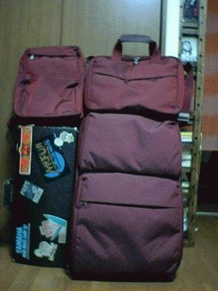

# [mixi] スーツケースが届く

**作成日:** 2006-07-17

マンダリナダックのスーツケースが今日届いた。

Workというシリーズの赤（カルミニオ）。

Workシリーズの鞄は三つ目。

しばらく長期の旅行に行く予定はないのですが、ロンドンへ一緒に行った人が同じスーツケースの青を使ってて、中を見せてもらったらよくできてたので帰国後調べてみたら、カルミニオは廃番になってるし、楽天でセールをしてる店がありカルミニオを売ってたので、今買わないともう手に入らないかと思って、とくだくだ言い訳してみる。誰に？

左側のアルトのケースの上に載ってるのが最初に買ったやつ。

スーツケースの上にあるのは、B級品でファミリーセールで安く買ったやつ。

自宅で見たら、思ってたよりやっぱり大きい。

バルケッタのトランクには、入らない、かなあ。

---

## イイネ (12)

- きたまこと
- KOHJI＠掬水月在手
- ゆみちん
- まほ
- タク
- Buddy
- れい
- れてぃ
- arancio
- ぷち
- YASUO
- さぁ

---

## コメント

**マイリスト**

マイミク一覧

**スーツケースが届く編集する**

2006年07月17日23:29

**れてぃ2006年07月18日 01:50**

チャールストン色？
ついエンジ色には反応してしまいます。

**arancio2006年07月18日 16:04**

あ、確かにチャールストン色。
赤い色の小物けっこう持ってます。
好きなんですよね。

**ぷち2006年07月18日 20:26**

こういう形の揃ったシステマチックなもの、大好きです。
シンプルなのも美しくていいですね。

**arancio2006年07月18日 20:39**

やわに見えますが、けっこうがっちりしてます。
防水加工もしてあるらしい。
その代わり、それなりに重いですけど。
リモワのアルミのスーツケースとそれほど重さが変わりません。
いつかリモワと思ってるんですが、しばらくお預けです（笑）。

**2026年**

01月
02月
03月
04月
05月
06月
07月
08月
09月
10月
11月
12月
