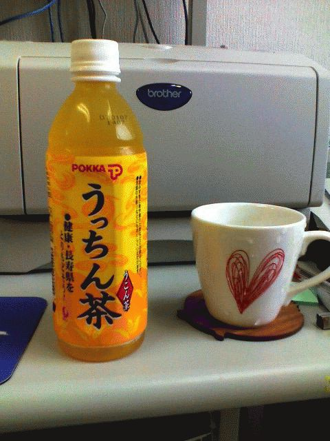

# [mixi] うっちん茶

**作成日:** 2006-07-21

沖縄フェアの名残りで生協では「うっちん茶」販売中。

それほどひどい二日酔いではなかったのだけれど、買って飲んでます。

おいしい。

今朝、ウコンのサプリ飲んできたんですけどね。

---

## イイネ (11)

- きたまこと
- KOHJI＠掬水月在手
- ゆみちん
- まほ
- KotetsU
- タク
- Buddy
- れい
- arancio
- YASUO
- さぁ

---

## コメント

**マイリスト**

マイミク一覧

**うっちん茶編集する**

2006年07月21日13:45

**KotetsU2006年07月21日 14:51**

この名前、大声で言いにくいですよねー。

**arancio2006年07月21日 15:47**

小声で言っても変じゃない？
ウコンもいいやすくはないなあ。

**KotetsU2006年07月21日 16:26**

いつも行く六甲道の沖縄料理屋でも、
何飲む？って聞かれても、
「う・・・、さんぴん茶！」って言う僕です。

**arancio2006年07月21日 17:17**

よわー。

**2026年**

01月
02月
03月
04月
05月
06月
07月
08月
09月
10月
11月
12月