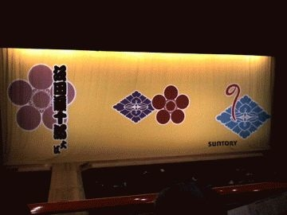
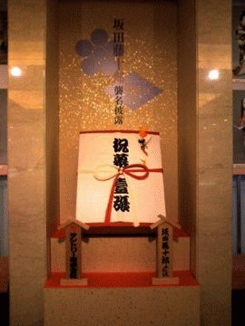

# [mixi] 松竹座へ行く

**作成日:** 2006-07-26

22日（土）は松竹座で藤十郎襲名披露を観ました。

藤十郎は特別好きではないのですが、縁があるというか、中座の鴈治郎襲名披露のチケットにあたって初めて歌舞伎を観たし、近松座の二十周年も南座で観てます。

母と妹と三人だったので車でおでかけ。

10時過ぎだったので、長堀の駐車場も、心斎橋の商店街もがらがらでびっくり。劇場に入って1階ロビーで、安藤忠雄を見かける。「わー」と思ったのは私一人だったみたいでちょっと寂しい。

一つ目の演目は信州川中島。ほとんど寝てました。

秀太郎の歌と琴が上手でそこは起きました。

二つ目連獅子。翫雀と壱太郎親子。

15歳の壱太郎君が楷書的というか、折り目正しく踊っていて、初々しくて悪くなかったですが、すらっとのびた手足を生かすにはまだまだといった感じでした。親獅子はもうちょっと威厳が欲しかったです。

で、口上があって、最後の演目は、今回のお目当て、夏祭浪速鑑。

これは夏芝居として有名なもので、舞台上でホンモノの水（本水、ほんみず）を使います。本水のある芝居って観たことないのですごく楽しみにしてました。ストーリーは一言でいうと侠客もの。

期待してた本水ですが、うーん、欲求不満が残りました。

思ったより水を使ってなかったんです。

2階席だったので、せりの仕掛けとかが見えたせいかもしれない。

以前、TVで観たやつは派手に水を使ってたような気がするんですが、あれはコクーン歌舞伎だったんだろうか。

芝居全体としては、夏の風情の描き方がうまく、歌舞伎の演出の蓄積された知恵というか技術には感心しました。夏の狂気、というか。大阪は昔から暑かったんだなあ、と思いました。スパイク・リーのDo the right thingを思い出した。

期待の仁左衛門はかっこ良かったけど、やっぱり出番少なし。

我當、この人好きじゃないんですけど、三婦役良かったです。

お父さんに一番声が似てると思うんだけど、芸は....

お客さんの入りももう一つ、グッズ類もそれほどなくて、大型襲名続きでもう襲名で盛り上げるのってだめなんじゃないのって感じだったのがちょっと寂しい感じでした。

終演後、ゆっくりめに1階ロビーに降りたら、ほとんどもうお客さんがいなくて、扇千景さんがいたので、母は記念撮影してもらいました。

---

## イイネ (9)

- きたまこと
- KOHJI＠掬水月在手
- ゆみちん
- まほ
- タク
- Buddy
- れい
- YASUO
- さぁ

---

## コメント

**マイリスト**

マイミク一覧

**松竹座へ行く編集する**

2006年07月26日23:14

**2026年**

01月
02月
03月
04月
05月
06月
07月
08月
09月
10月
11月
12月
