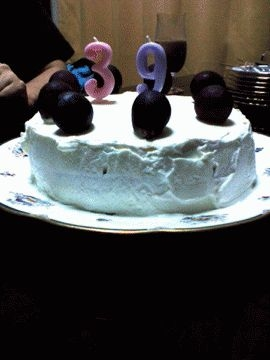
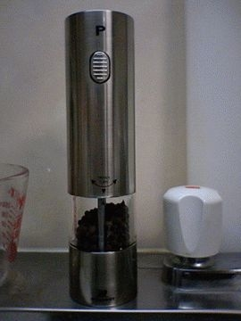
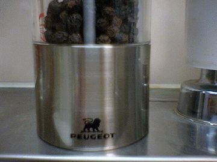

# [mixi] プレゼント

**作成日:** 2006-07-27

23日（日）は実家で誕生パーティーというか、手巻き寿司大会。

こどもたちは、かにとえびといくらとか、三種類ずつぐらい具を入れてえらい豪華。

小学生の甥と姪からは誕生カードをもらう。おもちゃの指輪つき。

こどもとお風呂に入ったり、将棋したり忙しい夜でした。

ケーキは妹が前日スポンジを焼き、当日デコレーションしてくれたのですが、夕方近所のケーキ屋に「ろうそく買ってくる」と出かけたので、「何本買ってくるんやろ」と言ってたら、写真の通り。ううん。

プレゼントはリクエストしてた電動ミルをもらいました。

電動ミルって、なんとなく自分で買うのは贅沢な気がする品物じゃないですか？

今までプジョーのミルを使ってた（福岡のコンランショップで買った）んですが、今回もらったミルも偶然プジョー製。ライトつき。ムダに明るいです。

---

## イイネ (15)

- きたまこと
- ほいほい
- KOHJI＠掬水月在手
- けん
- jamaica
- ゆみちん
- まほ
- KotetsU
- タク
- Buddy
- れい
- れてぃ
- arancio
- YASUO
- さぁ

---

## コメント

**マイリスト**

マイミク一覧

**プレゼント編集する**

2006年07月27日01:30

**KotetsU2006年07月27日 08:24**

おめでとうっす！

**arancio2006年07月27日 11:50**

ありがとうございます。

**けん2006年07月27日 12:51**

そのろうそく、そういうふうに使うもんやったんや..

**ほいほい2006年07月27日 12:54**

こんなにたくさんの人から、こんなに手をかけてお祝いしてもらえるなんて、アランチョさんは愛されてるんですね。いいなあ。家族が身近でうらやましいです。

**れてぃ2006年07月27日 16:30**

おめでとうございます！　ライト付き？？？　今年のキャノンボールは胡椒を多用する予定です。細挽き、粗挽き、ミニョネット(金鎚でわったもの)を使います。

**arancio2006年07月27日 16:47**

＞んけんさん
そういう風に使われました。
妹が「2年置いといて私の時に使って」と言ってました。
＞ほいほいさん
一人だけ遠くに住んでるんですけど、身近といえば身近です。
誕生会は、こどもたちのためにできるだけ行事を多くという母の方針のおかげです。子育ての苦労もせずこどもたちと楽しく遊んで、妹達には感謝しています。
＞れてぃさん
胡椒がかかった量が確認できて良いということで、TVで料理するタレントさんたちがこぞって、ライトつきを勧めてました。
あと片手で使えて楽。

**れてぃ2006年07月27日 17:15**

片手は判りますが量の確認に必要？？なんですか。我が家の一号機ミルはかれこれ20年選手です。２号機は片手で使えかなり粗くひけます。ライト欲しいなんて気がつかなかったなぁ。いろいろ需要ってあるもんですね。

**arancio2006年07月27日 22:45**

なくても困らないけど、あるとうれしいってあたりが、需要の開拓なんでしょうか。

**jamaica2006年07月27日 23:49**

自分ではなかなか買わないけど、もらうとうれしい物って
ありますよね、実際。

**2026年**

01月
02月
03月
04月
05月
06月
07月
08月
09月
10月
11月
12月