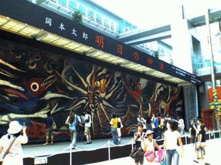

# [mixi] 東京一泊二日

**作成日:** 2006-08-01

週末東京に行ってました。

土曜の午後に羽田到着。表参道へ行くのに、新橋を通るルートを乗換案内が出してきたので、ちょっと寄り道して「明日の神話」を見た。

あいにくの曇り空で、期待したほど鮮やかな色彩じゃなかったけど、近くで見るとはやり迫力がある。時間が経つに連れて重みを増してくるような絵でおもしろかった。

表参道ではお買い物。

予定外の買い物もしちゃいましたが、これは別エントリで。

夕食は「ら　りゅぬ」というフランス料理屋さんへ。予約してなかったので、カウンター席になりましたが、シェフの話が聞けて楽しかったです。ラードの中で保存中の鴨のコンフィ見せてもらったり。それから銀座でベルギービールを飲んで就寝。

日曜の午前は伊東屋でぶらぶらした後、ラ・ベットラ・ダ・オチアイへ行きたかったのですが、日曜定休だったので（泣）、ランチ場所を求めて本屋さんでガイドブックをあさる。銀座って日曜定休の食べ物屋多いんですねえ。

「泥武士」という自然食レストランに行ってみる。

当たりでした。その後、国立博物館の「若沖と江戸絵画展」へ。

凄かったです。感想は別に書きます。

上野から早めに空港へ行って、食べたことがなかったので、万世のカツサンドを買ってラウンジでつまみつつ、和楽を読んでゆっくり。和楽、すごくおもしろいし、定期購読したい気はするけど、毎月あの分厚いのがきてうちにたまって行くと思うとやっぱり嫌なんですよねえ。

有意義に過ごせた週末でした。

---

## イイネ (11)

- きたまこと
- KOHJI＠掬水月在手
- ゆみちん
- まほ
- タク
- Buddy
- れい
- れてぃ
- arancio
- YASUO
- さぁ

---

## コメント

**マイリスト**

マイミク一覧

**東京一泊二日編集する**

2006年08月01日01:01

**れてぃ2006年08月01日 01:30**

そうなんですよ。日曜の銀座閉まってるところ多いんですよ。日曜は銀座ライオンで呑んだくれるのが定番でしたが、ビールおいしくなくなっていてショックでした。

**arancio2006年08月01日 01:33**

日曜に銀座に遊びに来るようなおのぼりさんは相手にしない、ってことでしょうかねえ。稼ぎ時なのにと思う私は関西人。

**れてぃ2006年08月01日 01:49**

和光なんてもろその理由で昔は日曜閉めてましたもんね。日曜の銀座って普段より健全なイメージがありそれはそれで好きなんですけどね。

**arancio2006年08月01日 01:58**

歩行者天国なんかいい感じですよね。
お店がどういうお客さんを大事にするのかを選ぶのはわかるんですが、ちょっと寂しい感じもしますねえ。

**2026年**

01月
02月
03月
04月
05月
06月
07月
08月
09月
10月
11月
12月