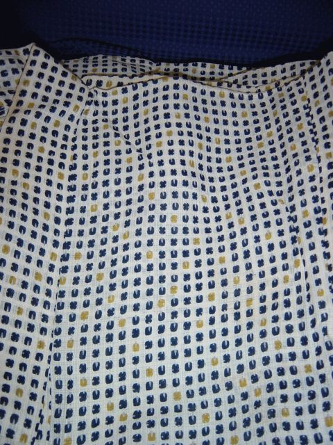
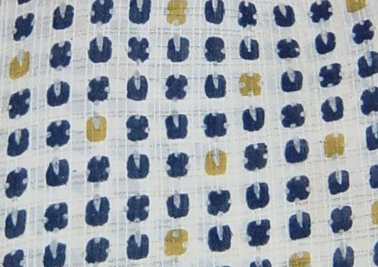

# [mixi] 絹紅梅

**作成日:** 2006-08-01

表参道で浴衣用の小物でも見ようかなと思って入った着物の古着屋。

巾着などは高かったのですが、夏着物のコーナーが！

ええ、結局買いました。4725円のやつ。

手ぬぐいみたいな柄だけど、あててみたら、よく似合ってた（と自分では思った）んです。

ちょっと変わった生地なので何ですかと聞いたら「絹紅梅」とのこと。紅梅は当て字だそうで、格子状に織ってある夏着物の生地。

汗じみが少しあるので、洗濯どうしたらいいですか、と聞いたら、レジの近くにいたちゃきちゃきの江戸っ子といった感じのおじいさんが、すごく詳しく教えてくれました。水洗いして、糊付しなさいということだったのですが、糊はふのりか、ゼラチンを使えとのこと。ゼラチンは店員さんたちも「へぇー」と感心してました。

このおじいさん、古着屋のお向かいのクリーニング屋さんでした。そういわれてみれば、Tシャツがまぶしいくらい白かった。いい着物を選んで「目が強い」と褒めてもらいました。

あと洗い張り屋さんが使う奥の手も教えてもらったのですが、これは内緒にしときます。

今日、スーパーへ行って洗濯糊を探したけど、アイロンかけ用のしか売ってなかったです。板ゼラチンならうちにあるけど、濃度がわかんないから使いたくないしなあ。

恥ずかしながら、糊づけってしたことなくて、ちょっとお勉強したのですが、糊づけすると生地の通気性があがって涼しくなるんですね。知らなかった。

---

## イイネ (13)

- きたまこと
- KOHJI＠掬水月在手
- おおせ
- ゆみちん
- まほ
- タク
- Buddy
- れい
- れてぃ
- arancio
- ごみりん
- YASUO
- さぁ

---

## コメント

**マイリスト**

マイミク一覧

**絹紅梅編集する**

2006年08月01日01:31

**れてぃ2006年08月01日 08:08**

勉強になります。

**ごみりん2006年08月01日 18:01**

>絹紅梅
”きぬこうばい”と読むんですか？
>糊づけすると生地の通気性があがって涼しくなるんですね。
おお！勉強になりました。
着物の古着は風情があっていいよね♪
あと、生地の汚れをブレーキクリーナーで落としたりします（笑）

**arancio2006年08月01日 18:08**

＞れてぃさん
もうちょっと勉強します。
＞ごみりんさん
「きぬこうばい」です。
ブレーキクリーナーで汚れ落とし？
ベンジンみたいなもんかな。

**おおせ2006年08月01日 21:18**

浴衣いいですね！着ているところも、ぜひ写真みたいなあ(^｡^)　クリーニング屋さんに会うって、グッドタイミング～

**2026年**

01月
02月
03月
04月
05月
06月
07月
08月
09月
10月
11月
12月
