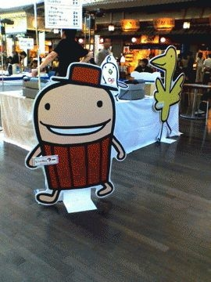
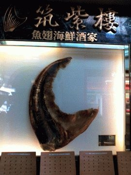
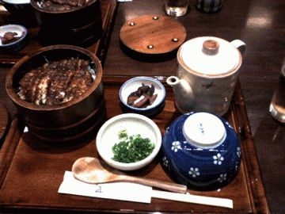

# [mixi] セントレア　中部国際空港

**作成日:** 2006-08-05

初めて中部国際空港を利用しました。

時間があったので、早めに空港へ行って、うろうろしました。

思ったより市内から近かったです。

関空くらいの空港を想像してたけど、かなりこじんまりしてました。展望デッキからは飛行機と海が一緒に見渡せて気持ち良かったです。

お土産ものを見て回った後、少し早めに夕食をとりました。

ひつまぶし。おいしかったです。

その後はカードラウンジに行ってコーヒー。

セントレアのカードラウンジは、アルコール類が無料。

でも私は長崎空港から運転なので飲めない。

一緒に行った友達は、鰻屋さんで生ビール2杯飲んだ後だったので、やっぱり飲めなくて二人で悔しがってました。

夏休みらしく、家族連れでいっぱいでした。

写真はセントレアのマスコットキャラたち。ゆるキャラ揃い。

二枚目 中華料理屋があって、大きいふかひれをディスプレイしてたので、写真を撮ってみた。中華は食べてません。

---

## イイネ (13)

- きたまこと
- ほいほい
- KOHJI＠掬水月在手
- ゆみちん
- まほ
- タク
- Buddy
- れい
- れてぃ
- arancio
- でんじろう。
- YASUO
- さぁ

---

## コメント

**マイリスト**

マイミク一覧

**セントレア　中部国際空港編集する**

2006年08月05日01:37

**れてぃ2006年08月05日 04:08**

出張お疲れさまでした。ひつまぶしは活字にするとひまつぶしに見間違えてしまいます。

**ほいほい2006年08月05日 07:32**

たしかにゆるい…、泣けるくらいに。

**arancio2006年08月07日 00:59**

＞れてぃさん
ある意味「ひまつぶし」でした。
＞ほいほいさん
イマイチ意味もわからない。泣けます。
http://
enjoy.c
entrair
.jp/cen
trair-f
riends/
index.h
tml

**でんじろう。2006年08月07日 22:29**

セントレアまだ行ったことないのですー！
うちの近くから船でぴゅっと行けるのにぃ。

**arancio2006年08月07日 22:37**

＞でんじろう。さん
クイーンアリスか、トゥーラントッドでお食事したら、教えてくださいね。温泉もあったけど、はいってません。

**2026年**

01月
02月
03月
04月
05月
06月
07月
08月
09月
10月
11月
12月
