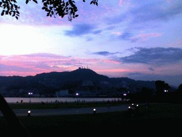

# [mixi] 浴衣祭

**作成日:** 2006-08-07

本日は「ビール祭」あらため「浴衣祭」に参加しました。

よーするに屋外飲み会です。

ルール(?)は和装で参加すること。

16,7人いたけど、全員和装ってなかなかすごかったです。

先日買った着物を着て出かけたのですが、よく考えると、桐下駄、帯、帯板、浴衣スリップぜーんぶおニュー（死語？）でした。下駄、帯、帯板は去年買ったけど、使う機会がなかったのです。

長崎は西なので、7時過ぎでもまだ明るいです。

写真は稲佐山です。

---

## イイネ (12)

- きたまこと
- KOHJI＠掬水月在手
- けん
- まほ
- ゆみちん
- タク
- Buddy
- れい
- れてぃ
- arancio
- YASUO
- さぁ

---

## コメント

**マイリスト**

マイミク一覧

**浴衣祭編集する**

2006年08月07日01:11

**れてぃ2006年08月07日 04:29**

綺麗な夕焼けですね。

**けん2006年08月07日 06:04**

頭が小さいので浴衣似合いそうですね

**arancio2006年08月07日 20:58**

＞れてぃさん
夕焼けきれいでした。
写真より実際はもう少し明るかったです。
＞けんちゃん
頭小さいかなあ？背も小さいですからねえ。
若い子の浴衣の着こなし、身のこなしって、終わってるから、それと比べれば勝ってるかも。:-P
若い女性の和服姿で素晴らしいのは、阿波踊りのお姉さんたちですね。きちっと着こなしてるし、薄手の衣装が実に色っぽいですよぉ～。

**2026年**

01月
02月
03月
04月
05月
06月
07月
08月
09月
10月
11月
12月
