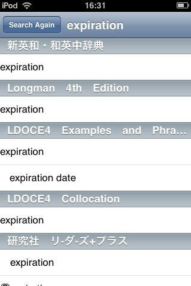
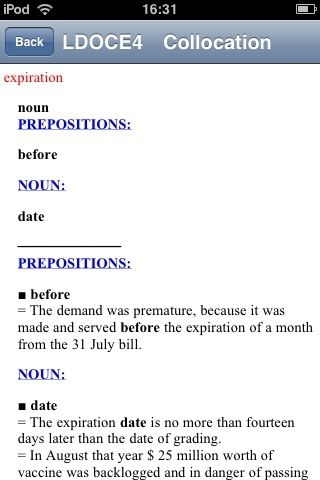

# [mixi] iDic on iPod touch

**作成日:** 2008-11-21

iPod touchが来てから2ヶ月近くたちました。

iPhone/iPod touchにはiDicという辞書ソフトがあったので、iPod touchを買うのを決めました。手持ちの辞書データが使えるからです。

ただiDicは要脱獄のソフトで、私のiPod touchはまだ脱獄ツールがないので、App storeでの配布を待ってました。iDicのホームページでは告知がなかったのですが、いつの間にか App Storeで売り出されてました。ゆうべとあるブログの記事で知って、さっそくインストール。

手持ちの辞書データは、Mac側にDiskAidというソフトを入れるとtouchが外づけディスクとしてマウントできるので、それを使って手動でコピー。クリエで使ってたデータをそのまま使ったので、一部の圧縮ファイルが不具合を起こしましたが、非圧縮のファイルを置きなおして、無事すべての辞書が検索できるようになりました。

クリエでも同じことができてたんですが、動作の軽さと表示の美しさが圧倒的に違います。似たようなことができるのに別世界。クリエの方が画面は大きいんですが
。前方一致検索をするので凄い数の見出し語が並びますが、すいすい（というより軽い車輪をくるくる回してるみたい）スクロールできるので、全然苦になりません。

語釈の中に便利なリンクがあることにiPod touchを使ってて初めて気がつきました。同じデータをPCでも使ってるのですが、画面が広いのでわざわざリンクをたどったことがありませんでした。touchの狭い画面ではけっこう役に立ちます。

あ、あとリーダーズ＋にエルビス・コステロが載ってるのも、touchで辞書引きして初めて発見しました。前方一致検索なので、調べてない単語も目に入ってくるのが楽しいです。

---

## イイネ (11)

- きたまこと
- KOHJI＠掬水月在手
- 塾長
- ゆみちん
- まほ
- タク
- Buddy
- arancio
- ケルマデック
- YASUO
- さぁ

---

## コメント

**マイリスト**

マイミク一覧

**iDic on iPod touch編集する**

2008年11月21日21:57

**塾長2008年11月22日 04:26**

一瞬卑猥な英語のフレーズかと思った苦笑

**arancio2008年11月22日 16:10**

> 塾長さん
どんなフレーズか気になる～。

**塾長2008年11月22日 17:11**

いやいや、なんとなくdic on i touch【sic】のランダムな羅列を見たらねえ…苦笑

**arancio2008年11月23日 00:50**

プライミング効果ってやつですね（笑）。

**塾長2008年11月23日 00:53**

かも知れない笑
my mind must be in the gutter...lol

**arancio2008年11月23日 01:19**

「掃き溜めに鶴」ということばもありますね。
Longmanのgutterの項にはかわいい洋館の写真が出てきました。
ちなみにcatをひくと黒猫の写真が出てきます。かわいいんですよ、これが。

**塾長2008年11月23日 01:33**

black cat...hmmm i was about to come up with yet another sexual innuendo苦笑
now i am really driving my mind into the f---ing gutter
笑

**arancio2008年11月23日 02:39**

American Heritageのcatに"A player or devotee of jazz music"がありましたよん。

**塾長2008年11月23日 03:01**

オレの意図した事はdefinitionの中でももっとも下品な事で、多分辞書に書けないです笑
なんか旨いもん三昧でんな～

**arancio2008年11月23日 03:04**

三昧ってほどでも
。
パンは明日のお楽しみです。

**2026年**

01月
02月
03月
04月
05月
06月
07月
08月
09月
10月
11月
12月
