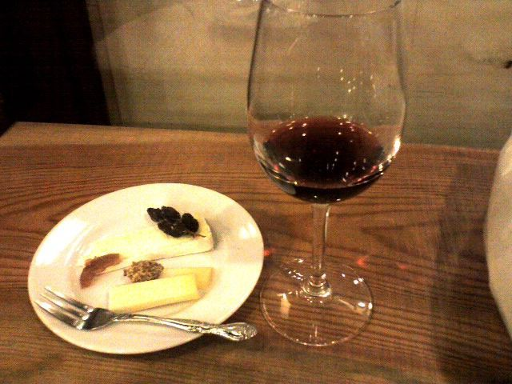

# [mixi] 天神西通り

**作成日:** 2008-11-23

6時頃に業務終了で、天神へ向かいました。

9月に福岡に一週間弱滞在してた時に編み出したコースを2時間くらいで回りました。しばらく定番のコースになりそうです。

天神駅から地下街を通って三越の食料品売り場へ。

ポールでカヌレとちっさいバゲットを買う。どちらも最後の一個。ラッキー。

国体通りと渡辺通りの交差点に出て、アップルストアへ。

10月から近日発売になったままのマイク付きヘッドフォンの発売予定について聞いてみました。わからないと言われたのですが、とても感じのいい対応だったので満足して店を出る。

それから酒屋ナカムラへ。ワインの角打ちをやってる店。

今年は航空便のボジョレーヌーボーを買うつもりはないので、ここで飲んでおこうと。飲むなら買えって話もありますが
。チーズをつまみに、ボジョレー・ビラージュとボジョレーを1杯ずつ飲んで、飲みすぎないうちに退散。

この店のすぐ近くにAVEDAのショップがあるけど、今日はパスして、Zaraへ。買い物というより、年末のバーゲンに備えての下見（笑）。ニットを1枚買ったけど、ユーロでの価格を見ると円高の恩恵がなくてちょっと悲しい。元が安いので、大した額ではないですが。

お次は、岩田屋。1Fで小物をちらっと見て、地下の食料品売り場へ。ティータイムなら、ジャン・ポール・エヴァンのカフェでショコラ・ショーを飲むのですが、今日はパス。カフェは小さいのですが、東京と違って、いつもすいてるので待つこともありません。食料品売り場を抜けて、コンランショップへ。本店の地下に移ってからのコンランは以前ほど魅力的ではないのですが、それでも足が向きます。主に食器をみて終わり。コンランは見る方が主で、ほとんど買い物したことがありません（笑）。定番コースはこれにて終了。ほとんど天神西通りで完結してます。

夕食はソラリアの天神ホルモンでホルモン定食を食べました。

時間に余裕があるつもりだったのですが、店内に入ってからも料理が出てくるまで意外に時間がかかり、予約してた特急に乗り遅れるかとひやひやしましたが、ぎりぎり間に合いました。走ったりしなくて済んで良かったです。

ホルモン、おいしかったです～。

---

## イイネ (9)

- きたまこと
- KOHJI＠掬水月在手
- ゆみちん
- まほ
- タク
- Buddy
- ケルマデック
- YASUO
- さぁ

---

## コメント

**マイリスト**

マイミク一覧

**天神西通り編集する**

2008年11月23日02:33

**2026年**

01月
02月
03月
04月
05月
06月
07月
08月
09月
10月
11月
12月
