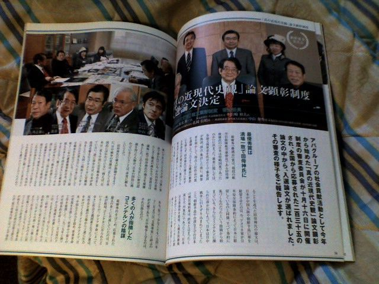
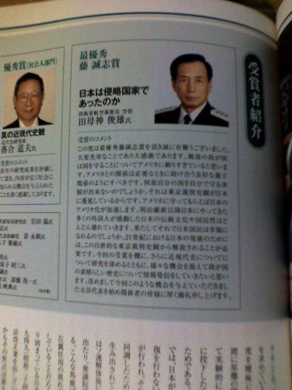
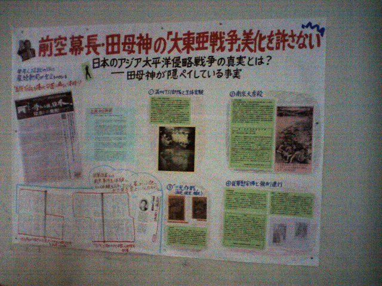

# [mixi] タイムリー

**作成日:** 2008-12-02

今回、アパに宿泊してたんですが、部屋に田母神論文が掲載された雑誌が置いてありました。価格はついてますが、ロビーにもパンフレット類と一緒に置いあったし、実質フリーペーパーのようです。

新聞の記事によると学生賞をもらった人は、田母神論文と同点だったが、アパの元谷代表が学生は賞金30万で十分と言って、学生賞になったとか。300万円が30万円って、学生賞のお兄さんにあらためて受賞のコメントを聞きたいものです。掲載されてる受賞コメントでは、丁寧に感謝を述べられています。

http://
www.asa
hi.com/
nationa
l/updat
e/1201/
OSK2008
1201000
8.html

おまけ　金沢大学のキャンパスで見かけた張り紙。大学っぽい。

---

## イイネ (9)

- きたまこと
- KOHJI＠掬水月在手
- ゆみちん
- まほ
- タク
- Buddy
- ケルマデック
- YASUO
- さぁ

---

## コメント

**マイリスト**

マイミク一覧

**タイムリー編集する**

2008年12月02日00:25

**2026年**

01月
02月
03月
04月
05月
06月
07月
08月
09月
10月
11月
12月
